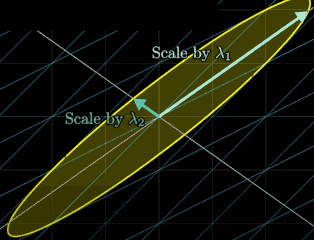

[](...menustart)

- [15. A quick trick for computing eigenvalues](#7caa83ff4a782038db7aea2476ea082a)

[](...menuend)


<h2 id="7caa83ff4a782038db7aea2476ea082a"></h2>

# 15. A quick trick for computing eigenvalues

At least for 2x2 matrices, there's a much more direct way to get the eigen values.

Ther are only 3 relevant faccts you need to know, each of which is worth knowing in its own way and can help you with other problem-solving.

1. The trace of a matrix, which is the sum of these 2 diagonal entries,  is equal to the sum of the eigenvalues.
    - 
    - Or another way to phrase it, more useful for our purposes, is that the mean of the 2 eigenvalues is the same as the mean of these 2 diagonal entries.
    ```python
    ( a+d )/2 = ( λ₁+λ₂ )/2 = m (mean)
    ```
2. The determinant of a matrix, our usual `a*d-b*c` formual, is equal to the product of the 2 eigenvalues.
    - 
    ```python
    ad-bc = λ₁λ₂ = p (product)
    ```
    - and this should kind of make sense if you understand that eigenvalues describes how much an operator stretches space in a particular direction and that the determinant describe how much an operator scales areas (or volumnes)  as a whole.
    - 
    - ex:
    ```octave
    a =
       8   4
       2   6
    ```
    ```python
    m = 7
    p = 48-8 = 40
    ```
    ```python
    40  = ( 7+d )( 7-d )
        = 49 - d²
    d = 3
    ```
    - for any mean *m*, and product *p*, the *d²* is always going to be `m²-p`. This gives the 3rd fact.
- **λ₁, λ₂ = m ± √(m²-p)**
    ```octave
    a =
       3   1
       4   1
    ```
    ```python
    λ₁, λ₂ = 2 ± √(2²-(-1)) = 2 ± √5
    ```


