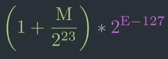
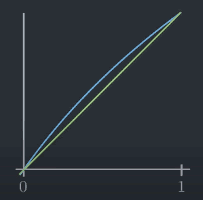
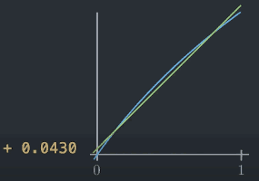

...menustart

- [Fast inverse square root](#fd0c1d9aa5c1114b0d1a121361ec3fcd)
    - [Quick Explanation](#6c3b212bf86a46fbb98a3085f6fdec14)
    - [Float Number](#faafd474460843cc23aab577dafe2eed)
        - [IEEE 754](#776e1df999f0815d67390cb5cae8bde7)
    - [Take Logarithm](#a324623c1acc31a4a79c6a4d1bfb9c74)
    - [Evil Bit Hack](#01dc9266d320e77910fce13444702445)
    - [What The Fuck](#421fbe1be97360cced700a3845a5d5a3)
    - [Newton's Method](#34f2f7625c65991e958b586401593541)
- [Misc](#74248c725e00bf9fe04df4e35b249a19)
    - [Union version](#3c83e77ab96c7ece28fefa6d07cc1848)
    - [Cpp version](#9b2cb47f99e0c720811fd0291ac1a143)

...menuend


<h2 id="fd0c1d9aa5c1114b0d1a121361ec3fcd"></h2>


# Fast inverse square root

```cpp
float Q_rsqrt( float number )
{
    long i;
    float x2, y;
    const float threehalfs = 1.5F;

    x2 = number * 0.5F;
    y  = number;
    i  = * ( long * ) &y;                       // evil floating point bit level hacking
    i  = 0x5f3759df - ( i >> 1 );               // what the fuck? 
    y  = * ( float * ) &i;
    y  = y * ( threehalfs - ( x2 * y * y ) );   // 1st iteration
//  y  = y * ( threehalfs - ( x2 * y * y ) );   // 2nd iteration, this can be removed

    return y;
}
```

- Q: why would the game engine want to calculate 1/√x ?
- A: it helps to normalize vector when you implementing physics and lighting or reflections.

The square root is a terribly slow operation, and the devision is not much better. This is not good if we have thousands of surfaces where each has a vector that needs to be normalized.

If we can find even just an approximation of one divided by square root of x as long as it's fast we can save precious time.

The fast inverse square root is such an approximation with only an error of at most 1% while being 3 times as fast.

- There are 3 steps to this algorithm:
    1. Evil Bit Hack
    2. What the fuck
    3. Newton Iteration

<h2 id="6c3b212bf86a46fbb98a3085f6fdec14"></h2>


## Quick Explanation

- The algorithm accepts a 32-bit floating-point number as the input and stores a halved value for later use. 
- Then, treating the bits representing the floating-point number as a 32-bit integer, a logical shift right by one bit is performed and the result subtracted from the number 0x5F3759DF, which is a floating point representation of an approximation of √2¹²⁷. 
- This results in the first approximation of the inverse square root of the input. 
- Treating the bits again as a floating-point number, it runs one iteration of Newton's method, yielding a more precise approximation.

The algorithm compute 1⁄√x by performing the following steps:
    1. Alias the argument x to an integer as a way to compute an approximation of log₂(x)
    2. Use this approximation to compute an approximation of log₂(1/√x) = -1/2·log₂(x).
    3. Alias back to a float, as a way to compute an approximation of the base-2 exponential.
    4. Refine the approximation using a single iteration of Newton's method.


<h2 id="faafd474460843cc23aab577dafe2eed"></h2>


## Float Number

```python
00000000 00000000 00000000 00000000
```

We're given 32 bits, and we have to represent the decimal number with it. How would you do that? 

If you and I were designing decimal numbers this is probably one way we would do it -- just put a decimal point in the middle.

```python
# 4.75
00000000 00000100.11000000 00000000
```

But his idea is actually terrible. We've decimated the range of numbers we can represent around 2 billion  now only to about 32000.

Luckily people much smarter than us have found a better way to make use of those 32 bits.

They took inspiration from scientific notaion.

```python
23000       2.3·10⁴
0.0034      3.4·10⁻³
```

We can also represent them in a **binary system**.

```python
00011000    1.1·2⁴
   0.0101    1.01·2⁻²
```

The standard they came up with takes the name IEEE 754.


<h2 id="776e1df999f0815d67390cb5cae8bde7"></h2>


### IEEE 754

```python
0 00000000 00000000000000000000000
```

The IEEE 754 standard specifies a binary32 as having:

1. Sign bit: 1 bit 
    - The first bit is the sign bit
    - but the number Quack3 provides the fast inverse square root are always positive.
        - so for the rest of this article , we ignore the sign bit.
2. Exponent: 8 bits
    - the next 8 bits define the exponent [0,255]. But we also need negative exponents.
    - The exponent works in **biased form**:  everything is shifted down by 127, 
        - i.e. 127 represents the actual 0.
        - i.e. `00000100` means x·2<sup>4-127</sup>
    - [-127,128] ❌
        - Acutally, exponents range is **[-126,127]**, because -127(all 0s) and +128(all 1s) are reserved for special numbers(subnormal number , infinite ).
3. Mantissa : 23 bits ( 24 bits explicitly represent )
    - Significand precision
    - as usual in scientific notaion, we want to denote  1 digit, followd by the comma, followed by the decimal places
        - **0.00** ·2⁴
    - with 23 bits, we can represent number [ 0, 2²³-1 ]. Again, this is not what we need. For scientific notation we need the mantissa to go from 1 to 10. 
        - In binary scientific notation , we want mantissa go from 1 to 2.  We may put a comma after the first bit, this gives us number 1.0 ~ 1.999
        ```python
        0 10000011 0.0000000000000000000000
        ```
        - ❌ but this naive approach is wasteful.
    - People that designed standard IEEE 754 realized that in binary something happens that happens in no other base.
        - in scientifc notation, the first digit is by definition always non-zero ( 1-9 )
        - but in binary there is only one digit that is not zero -- ***1***.  If we know that the first digit will always be a `1`, there is no need to store it.  Thus we can save 1 bit by moving the comma one digit to the left, and fixing an extra `1` in the number it represents ( unless the exponent is stored with all zeros, i.e. subnormal number )
        ```python
        0 10000011 .00000000000000000000000
        ```
        - Now our mantissa is between one and two. Even though 23 bits gave us number [ 0, 2²³-1 ], we scaled then down to get the number [0,1), and then we added an extra 1 to get the number [1,2)
        ```python
        0 10000011 .00000000000000000000000
        # + 1.00·2⁴
        0 10000011 .11111111111111111111111
        # + 1.999·2⁴
        ```
        - mantissa `.11111111111111111111111`
            ```python
            >>> s = 0
            >>> for i in range(23):
            ...     s += 1.0/(2**(i+1))
            ...
            >>> s
            0.9999998807907104
            ```

This is the main part of IEEE 754, just so-called **normalized number**.  IEEE 754 also includes denormalized number, infinith, NaN, and two 0 zeros ( +0, -0 ). But we won't go into those because in Quake3 it happens that these are never inputs into our algorithm.

For the rest of this article it will be useful to think of the mantissa and exponent as the binary numbers they are.

<h2 id="a324623c1acc31a4a79c6a4d1bfb9c74"></h2>


## Take Logarithm

If we are given 2 numbers, one being the mantissa M , and 1 being the exponent E, we can get a bit representation with 

**2²³·E + M**. ( E is left-shifted by 23 bits ). 

But we get actuall number behind the bits with this fomula

- 

<details>
<summary>
from wikipedia
</summary>

- 

</details>


Now something completely different for no obvious reason at all let's take the logarithm of that expression.

- 

We simplify as much as we can 

log₂( 1 + <sup>M</sup>/<sub>2²³</sub> ) + E-127

We stuck. How to remove the remaining `log` ?  The trick is an approximation to log₂(1+x), for small values of x, **log₂(1+x) ≈ x**.  This approximation is actually correct for x=0 and x=1.

- 

But we'll add an additional term μ. This correction term can be chosen freely. But it turns out that setting mu to 0.0430 gives the smallest error on average for number between 0 and 1.

- log₂(1+x) ≈ x + 0.0430
- 

So going back to our formula we apply our trick

- 
    - = log₂( 1 + <sup>M</sup>/<sub>2²³</sub> ) + E - 127
    - = <sup>M</sup>/<sub>2²³</sub> + μ + E - 127
    - = ( <sup>M</sup>/<sub>2²³</sub>  + E ) + ( μ - 127 )
    - = ( <sup>M</sup>/<sub>2²³</sub>  + <sup>2²³·E</sup>/<sub>2²³</sub>  ) + ( μ - 127 )
    - = <sup>1</sup>/<sub>2²³</sub> ·(M + 2²³·E) + ( μ - 127 )

**2²³·E + M** appears again, that is our bit representation.

Let's think about what we just did. We applied the logarithm to our formular, and got the bit representation just scaled and shifted by some constants.  So in some sense the bit representation of a number is its own logarithm  ≈ log(itself)

Armed with this knowledge, we can finally start with the 3 steps of the fast inverse square root.


<h2 id="01dc9266d320e77910fce13444702445"></h2>


## Evil Bit Hack

```cpp
    i  = * ( long * ) &y;                       // evil floating point bit level hacking
```

Floats unfortunately don't come with the tools we need to do bit manipulation.  Here treating the bits representing the floating-point number as a 32-bit integer.  The address itself doesn't change, but now think the number living at that address is now a *long*.


<h2 id="421fbe1be97360cced700a3845a5d5a3"></h2>


## What The Fuck

```cpp
    i  = 0x5f3759df - ( i >> 1 );               // what the fuck? 
```

Let's remind ourselves what our goal is here ?

We have a number stored in y, and our goal was to calculate 1/sqrt(y).  Calculating this directly is too hard and too expensive. But we've extracted the bits from y and we've seen with the IEEE 754 that the bits of number are in some sense its own logarithm  `log(y) ≈ i `.  That means in *i* we have stored log(y)  up to some scaling and shifting. I claim that our problem becomes way easier if we work with logs.  Instead of trying so hard to calculate <sup>1</sup>/√y, we calculate log( <sup>1</sup>/√y ).

- log( <sup>1</sup>/√y ) = log( y<sup>-1/2</sup> ) = **-1/2·log(y)**
    - = **- ( i >> 1 )**
    - this is where `- ( i >> 1 )` comes from.


But why is this number `0x5f3759df` here ?  Because our logarithm is actually scaled and shifted.  Let Γ = 1/√y, 

- 
- 
- 

The magic number turns out to be the remnants of the error term μ, the scaling factor and the shifting.


<h2 id="34f2f7625c65991e958b586401593541"></h2>


## Newton's Method

```cpp
    y  = y * ( threehalfs - ( x2 * y * y ) );   // 1st iteration
```

After previous steps we have a pretty decent approximation but we did pick up some error terms here and there.  But thanks to Newton's Method we can make a really good approximation we can make a really good approximation out of a decent one.

Netton's method is a technique that finds a root for a given function f(x) = 0.  It does so by taking an approximation, and returning a better approximation, until you're close enough to the actuall solution.

```python
    f(x) = 1.982436
    f(x) = 1.029344
    ...
    f(x) = 0.000312
```

But it turns out that here we are already close enough to the actual solution  that one iteration suffices to get an error within 1%.

The only thing Newton's method need is the function and its derivative. 

- 

So this line `y  = y * ( threehalfs - ( x2 * y * y ) );   // 1st iteration` is one such Newton's iteration applied to the function 

`f(y) = 1/y² - x`.

Notice that y being a root of this function is equivalent to y being the inverse square root of x.

- 

```python
y = 1/√x 
y² = 1/x
1/y² = x
1/y² - x = 0
```

f'(y) = -2/y³

- y<sub>n+1</sub> = y<sub>n</sub> - f(y<sub>n</sub>) / f'(y<sub>n</sub>)
    ```python
    = y - ( 1/y² - x ) / ( -2/y³ ) 
    = y - ( y - x· y³ ) / ( -2  )
    = ( -2·y -  y +  x· y³ ) / ( -2  )
    = ( -3·y  +  x· y³ ) / ( -2  )
    = ( 3/2·y  +  1/2· x· y³ )  
    = y · ( 3/2  +  1/2·x· y · y )  
    ```


<h2 id="74248c725e00bf9fe04df4e35b249a19"></h2>


# Misc

<h2 id="3c83e77ab96c7ece28fefa6d07cc1848"></h2>


## Union version

According to the C standard, reinterpreting a floating point value as an integer by dereferencing a casted pointer to it is considered undefined behavior.

The following code is standards-compliant.

```cpp
#include <stdint.h>
float Q_rsqrt( float number )
{	
	const float x2 = number * 0.5F;
	const float threehalfs = 1.5F;

	union {
		float f;
		uint32_t i;
	} conv  = { .f = number };
	conv.i  = 0x5f3759df - ( conv.i >> 1 );
	conv.f  *= threehalfs - ( x2 * conv.f * conv.f );
	return conv.f;
}
```


<h2 id="9b2cb47f99e0c720811fd0291ac1a143"></h2>


## Cpp version

```cpp
#include <cstdint>
#include <bit>
inline constexpr float Q_rsqrt( float number ) noexcept
{
	float const x2 = number * 0.5F;
	float const threehalfs = 1.5F;
	auto i = std::bit_cast<std::uint32_t>(number);
	i  = 0x5f3759df - ( i >> 1 );
	number = std::bit_cast<float>(i);
	number  *= threehalfs - ( x2 * number * number );
	return number;
}
```


