# GPU Programming for Video Games

https://www.youtube.com/watch?v=i5yK56XFbrU&list=PLOunECWxELQQwayE8e3WjKPJsTGKknJ8w


# Notes

- Unreal(z-up), Unity3D(y-up), and Direct3D use LHS
    - but OpenGL and XNA (RHS in eye-space) suddenly turn to LHS in `clip space` ( canonical view volume )
- moving camera is equivalent to inverse moving the entire world
- rotation  must take the coordinate system into consideration.
    - LHS , clockwise if looking against axis
    - RHS , counter clockwise if looking against axis
- Canonical "clip space" view volume
    - D3D/XNA,   map z to [0,1] 
    - OpenGL/Unity, map z to [-1,1]

# 1. Introduction

- CS4455: Video Game Design
- CS4731: Game AI
- CS4496/7496: Computer Animation
- CS4480: Digital Video Special Effects

# 2. 3D Coordinate Systems

- The model for creating computer graphics in this class is generally called rasterization model.
    - this is in contrast to something like ray tracing.

Stage | Geometry Pipline |  Rasterization Pipeline
 --- | --- | --- 
Processing what | Vertices | Pixels
Mainly operations |  **floating-point** operations |   **integer** operations
Shader | vertex shader(3d vertex) | fragment shader(final color of pixel)

- Something about the vertex shader is that they process each vertex individually and they don't create new vertices. 
- There are other kinds of shader called geometry shaders that can create new vertices
    - and there's also computer shaders that are much more general kinds of things that might be thought of as more general-purpose GPU programming.
- We'll be focusing on vertex shader and fragment shader.

## 3D Coord

- Math textbooks use z-up
    - 
    - Z-up, Right-Handed System
- Real games tend to use y-up
    - if we enter the realm of computer graphics
    - 
    - Right-Handed System, +z toward the viewer
    - OpenGL, XNA
- There are also tools that use left-handed coordinate system ( Y-up )
    - 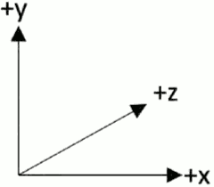
    - Left-Handed System, +z away from the viewer
    - Direct3D, Unity3D
- I shoud note that in traditional 2D games , Y values go downward.
- There are some tools out there that use a **Z-up** approach which is closer to math books
    - Z-up, Left-Handed System: Unreal
        - 
    - Z-up, RHS: Quake/Radiant, Source/Hammer, C4 Engine
        - 
    - Nearly everything still use Y-up for screen coordinates
        - even though these kinds of tools use Z-up when it concerns 3D coordinates, when do their final projection onto the 2D screen, they go ahead and use Y for the vertical coordinates.
    - if you take the left-handed system here, and rotate 90 degrees (along z axis), you can redraw it, and this is probably what you would see when you pull up the Unreal editor.
        - 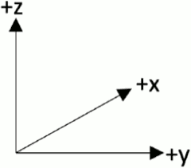
        - Unreal, Z-up, Left-Handed (rotate)

- 3D object modeling software
    - 
        - Z-up, Right-Handed System
        - 3D Studio Max, Blender
    - 
        - Y-up, Right-Handed System
        - Maya, Milkshape

---

Summary | Left-Handed | Right-Handed
--- | --- | ---
Z-up | Unreal  |  Math textbook, Quake/Radiant, Source/Hammer, C4 Engine, 3D Studio Max, Blender
Y-up | Direct3D, Unity3D  |  OpenGL, XNA, Maya, Milkshape


## Geometry format -- vertex coordinates

- At least at present , the models used in 3D games are formed from triangels.
    - each vertex of the triangle also has an associated unit normal, and this arises from the export process that your 3D artist will make from their 3D modeling software.

## Geometry format -- vertex color

- Some 3D models may also have color information associated with the different vertices. 
- But nowadays vertex colors are not actually used very much.
    - because usually that color information is embedded in some sort of 2D texture.
- Sometimes you will see this color slot being used, but it may be used form some other kind of information used in the rendering process and not typical color information.


## Specifying a 3D object 


- Vertex ordering is critical when culling model enabled
    - we essentially only want to render the triangles that are faced towards the viewer.
    - when approached this is to use the normal vector for the facet. 
        - **PS. these normals for culling are different than the vertex normals used for lighting.**
        - different vertices have different normals, but only 1 normal for a triangle.
    - The way we embed that kind of information is by choosing some sort of order to list the vertices.         - in either a left handed system, which in this case, { v1,v3,v2 }
- Question:
    - Are you using a LH or RH culling convention for these normal vectors ? 
    - That could be completely independent about rather your actual 3D coordinate system in your engine is LH or RH.


## Transformation Pipeline

- Model(World) Transformation
    - Model coordinates -> World coordinates
    - Model coordinates is what your artist works with. That's the coordinate system they're working within blender, maya, etc... 
    - We need to transform those coordinates into the world coordinate space and that's basically the view space of the level editor.
- View Transformation
    - World coordinates -> Camera space
- Projection Transformation
    - Camera space -> View plane


# 3D Vertex Transformations

- Model(World) Transformation
    - 
- View Transformation
    - 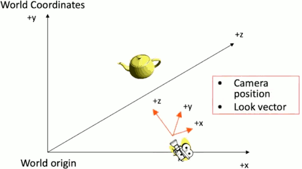
    - there are various ways to define a view transformation. but a nice conceptual way is to just imagine that the camera itself is another object in the scene like the box and teapot.
        - and if you create the equivalent world transformation matrix that would take a camera, place it at the correct orientation at a certain point in the scene, 
        - you can then imagine making the view matrix the inverse of that transformation, the inverse of that matrix.
        - and if you apply that to all the objects in the scene, it will orbit them around, and rearrange them.
- Projection Transformation
    - Set up camera internals
        - view frustum
        - view planes
    - Field of View(FoV)
    - There is a rich set of mathematical techniques concerning a concept called 

## homogeneous coordinates

- Enable all transformations to be done by "multiplication".
    - primarily for translation
    - so we can deal with a series of transformations by pre-multiplying those matrices together before applying them to 10000 vertices.
- Add 4th coordinate (w) to a 3D vecto.
    - translation itself can't be accommodated by multiplying a 3x3 matrix.
- Each vertex has [x,y,z,w]
    - w will be useful for perspective projection
        - where we need to divide by distance, and there is a convention for handling that by sticking the distance into the `w`.
    - w should be 1 in Cartesian coordinate system

## Transformation 1:  translation( offset )

- Example of a **row**-coordinate converion here
    - 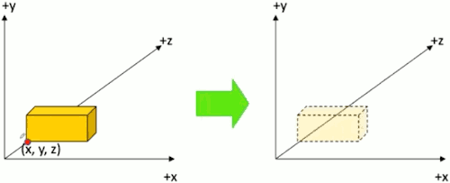
    - (**row**-coordinate)
    - 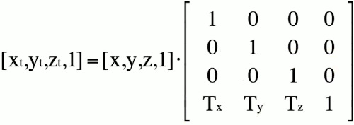 
    - Direct3D, XNA use row coordinates
        - also most documentation for HLSL/Cg uses this row vector convention
        - but HLSL itself doesn't really know what convention you're using, it just has these 4D vectors.
    - OpenGL, Unity & non-graphics world use column coordinates
- Example of **column**-coordinate
    ```ocatve
    ⎡Xt⎤   ⎡ 1   0   0  Tx⎤  ⎡X⎤
    ⎢Yt⎥ = ⎢ 0   1   0  Ty⎥· ⎢Y⎥
    ⎢Zt⎥   ⎢ 0   0   1  Tz⎥  ⎢Z⎥
    ⎣1 ⎦   ⎣ 0   0   0  1 ⎦  ⎣1⎦
    ```

## Transformation 2:  scaling

- 
- **row**-coordinate
    ```ocatve
    [Xs,Ys,Zs,1] = 

                ⎡ Sx  0   0  0 ⎤  
     [X,Y,Z,1]· ⎢ 0   Sy  0  0 ⎥  
                ⎢ 0   0   Sz 0 ⎥  
                ⎣ 0   0   0  1 ⎦  
    ```


## Transformation 3:  rotation

- Rotation is a lot trickier.
    - there is lots of different ways to represent rotations. 
    - some game engine like unity actually use a fairly sophisticated mathematical structure called `quaternions`, which are a 4D extension of the complex number to represent rotations.
    - dealing with quaternions gives a natural way of interpolating camera angles and also dealing with an issue called `gimbal lock`.
    - people design control systems for aircraft, we'll talk about pitch, roll, yaw.
    - unity and many other game engines think about a rotation around x-axis , and then rotation around y-axis, and then z-axis. The order you do these things are important.
- Rotation around x, y,z , in LEFT-Handed System
    - 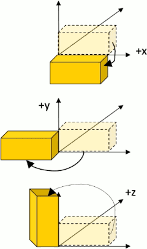
    - clockwise if you're thinking about looking again the particular axis
    - counter clockwise if you're thinking about looking down a particular axis
- If you're in a RHS, the clockwise/counter clockwise should inverse.
    - so you may have to check to see what conventions your game engine is using.

- 2D Rotation
    ```octave
    [X',Y',1] = 

              ⎡ cosθ sinθ 0 ⎤  
     [X,Y,1]· ⎢-sinθ cosθ 0 ⎥  
              ⎣  0    0   1 ⎦  
    ```
- 3D Rotation ( LHS )
    - for 3D: Rotate along which axis ?
    - Rotation along **Z** axis ( fix z )
        ```octave
        [X',Y',Z',1] = 

                    ⎡ cosθ sinθ 0  0 ⎤  
         [X,Y,Z,1]· ⎢-sinθ cosθ 0  0 ⎥  
                    ⎢  0    0   ⑴  0 ⎥  
                    ⎣  0    0   0  1 ⎦  
        ```
    - Rotation along **Y** axis ( fix y )
        - be careful about the sign of `sinθ`, it's switched
        ```octave
        [X',Y',Z',1] = 

                    ⎡ cosθ  0 -sinθ 0 ⎤  
         [X,Y,Z,1]· ⎢  0    ⑴   0   0 ⎥  
                    ⎢ sinθ  0  cosθ 0 ⎥  
                    ⎣  0    0   0   1 ⎦  
        ```
    - Rotation along **X** axis ( fix x )
        ```octave
        [X',Y',Z',1] = 

                    ⎡ ⑴   0    0   0 ⎤  
         [X,Y,Z,1]· ⎢ 0  cosθ sinθ 0 ⎥ 
                    ⎢ 0 -sinθ cosθ 0 ⎥  
                    ⎣ 0   0    0   1 ⎦  
        ```


## Specifying the view transformation

- Most commonly parameterized by
    - Position of camera
    - Position of point to look at
    - Vector indicating "up" direction of camera
- In Direct3D: D3DXMatrixLookAtLH
    - D3D use a LHS, but also have D3DXMatrixLookAtRH
- In XNA, Matrix.CreateLookAt (RHS)
- In OpenGL: gluLookAT (RHS)
- In Unity: Matrix4x4.LookAt (LHS)
    - but usually a programmer will only call this if they're doing some specialized weird thing because usually there's a camera class with various built-in scripts associated with it that will call such `LookAt` routine for you.


# 4 Orthogonal Projection 

## canonical view volumn

- 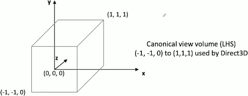

- Projection transform your geometry into a **canonical view volumn** in *normalized device coordinates* (clip space)
- Only X- and Y-coordinates will be mapped onto the screen
- Z will be almost useless, but used for depth test & advanced postprocessing effects

## Strange "conventions"

- 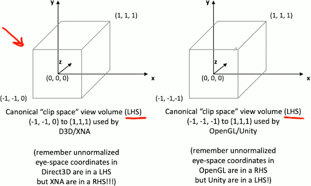

## Style of orthographic projection

- 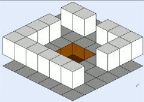

- Same size in 2D and 3D
- No sense of distance
- Parallel lines remain parallel
- Good for tile-based games where camera is in fixed location (elg. Mahjong or 3D Tetris)

## Orthographic Projection

- Canonical view volume ( D3D & XNA )
    - 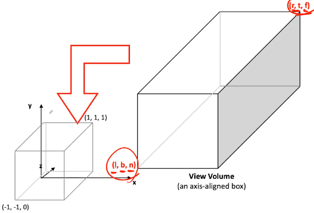
- Derive x', y'
    ```c
    l ≤ x ≤ r ,   -1 ≤ x' ≤ 1
    0 ≤ x-l ≤ r-l
    // divided by r-l
    0 ≤ (x-l)/(r-l) ≤ 1
    // double, and then -1
    -1 ≤ 2* (x-l)/(r-l) -1  ≤ 1

    -1 ≤ (2x-2l -r+l)/(r-l) ≤ 1
    -1 ≤ (2x-l-r)/(r-l) ≤ 1
    -1 ≤ 2x/(r-l) - (r+l)/(r-l) ≤ 1
    ```
    - 
        - double multiplier on x/y, and minus a constant
- Derive z' ( slightly different for the range in D3D )
    ```c
    n ≤ z ≤ f ,   0 ≤ z' ≤ 1
    0 ≤ z-n ≤ f-n
    // divided by f-n
    0 ≤ (z-n)/(f-n) ≤ 1
    0 ≤ z/(f-n) - n/(f-n) ≤ 1
    ```
    - 
        - a multiplier on z , and minus a constant.
    - OpenGL transform for z looks more like x&y transforms.


## Ortho projection matrix (LHS, row-coord)

- 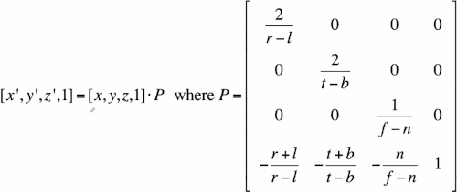
- In Direct3D: D3DXMatrixOrthoOffCenterLH( *o, l,r, b,t, n,f )
- In Unity: Matrix4x4.xxx( l,r, b,t, n,f )

- an interesting thing about the math here,  the matrix works regardless of rather you're using a RHS or LHS for your z-axis. 
    - that is, you can have `f-n`, and you could put in number , like  n=54, far=104 in a LHS,  or n=-50, f=-100 for RHS, you wouldn't have to change any of this
    - so that leads to something incredibly confusing that took me ages to figure out which is if you look in the Microsoft manual, you'll see that they actually flip `1/(f-n)` term for the RHS version of this call( see `Ortho projection matrix (RHS)` )


## Ortho projection matrix (RHS)

- 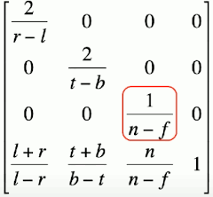
    - Math the same, but z clipping plane inputs in most API calls are negated , so the API need  z input parameters be positive
    - what's going on ? It turns out even if you're using a RHS , where the near plane in the view space is negative, say -50, these RH API calls expet your near and far plances to be listed as positive numbers.
    - so they essentially do that sign flip for you, to prevent people put negative value for n & f.
- In Direct3D: D3DXMatrixOrthoOffCenterRH( *o, l,r, b,t, n,f )
    - c based, return matrix to the poiner `*o`
- In XNA: Matrix.CreateOrthographicOffCenter( l,r, b,t, n,f )
- In OpenGL, glOrtho( l,r, b,t, n,f) (matrix is different, also use positve n & f)
    - OpenGL maps z to [-1,1] & uses column vectors
    - c based.  GL has a strange stack based computational model. a lot of their operations will create a matrix and shove onto the stack that then gets popped off later.


## Simpler ortho projection (LHS)

- In most orthographic projection setups
    - Z-axis passes through the center of your view volume
    - Field of view (FOV ) extens equally far
        - r = -l
        - t = -b

- 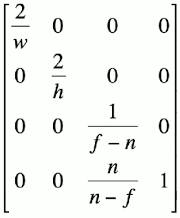
    - we do need to keep the flexibility of have different near and far planes.
- In Direct3D: D3DXMatrixOrthoLH( *o, w,h, n,f )

## Simpler ortho projection (RHS)

- 
- In Direct3D: D3DXMatrixOrthoRH( *o, w,h, n,f )
- In XNA: Matrix.CreateOrthographic( w,h, n,f )


# 5 Perspective Projection

## Viewing frustum

- 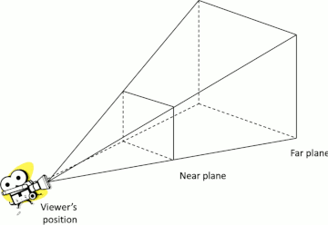
    - we're going to do is take this frustum , and project it into a rectangular volume.
- choosing the near and far plane is important from a practical issue in both orthographic and perspective projection because the z inforamtion is used to determine which objects are closer thant other objects in particular which objects are obscuring other objects.
    - if set your near and far plane too far apart, you may not have enough resolution in z to resolve that wel, and you can get the strange shimmering effect called **Z fighting**.

- 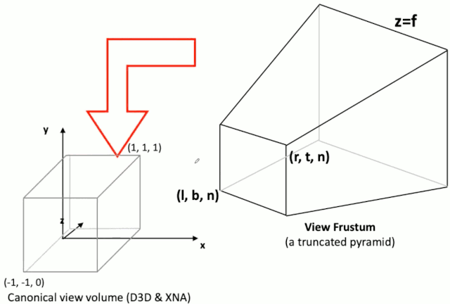

- Given a point (x,y,z) within the view frustum, project it onto the near plane z=n , x∈[l,r], y∈[b,t]
- We will map x from [l,r] to [-1,1], and y from [b,t] to [-1,1]

## Perspective projection math

- 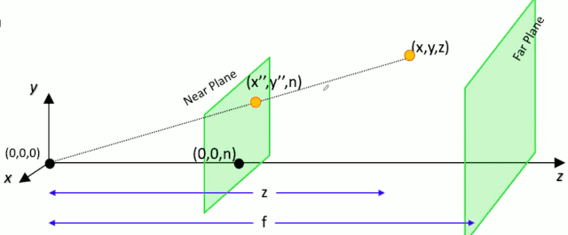
- 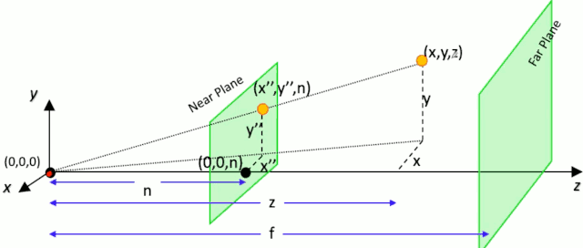
- To calculate new coordinates of x" and y"
    ```math
    x"/x = n/z ⇒ x" = nx/z

    y"/x" = y/x ⇒ y" = ny/z
    ```
    - this transformation is non-linear. we're going to have to do a division operation that you can't do with just a straight matrix multiplication.
- The next step is to map these x", y" into a [-1,1]  clip space.
    - 
    - the `z` in the first equation is not something we can represent with a matrix.
    - but if we multiply everything through by z, and just say, ok well we're not going to be dealing with x',y'.
        - What we're going to have here is `x'·z` and `y'·z`.
        - We're just going to say everything's going have z in it, and we'll get rid of that z later. 
    - and I can express this as a matrix computation.
- **We'll need to think a bit about what we want to do with z'.**
    - We know z(depth) transformation has nothing to do with x, and y.
    - Let's keep things consistent.
        ```math
        z"·z = p·z + q , where p and q are constants.
        ```
        - and try to figour out something here that make sense.
    - we know, (D3D) z'=0 when z=n, z'=1 when z=f , ( OpenGL z'=-1 when z-n )
        ```math
        0·n = 0 = p·n + q
        1·f = f = p·f + q
        ```
    - solve these equations
        - 
        - 
- Combine those equations
    ```math
    x'·z = ...
    y'·z = ...
    z'·z = ...
    w'·z = z  
    ```
    - 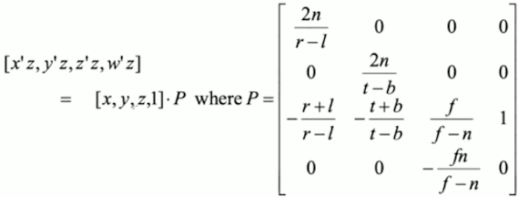
    - now I've got a question of what do I really want to do with this `w'` ?
        - the convention is that in any case we will  have to divide by z to obtain `[x',y',z',w']`
        - implemented by dividing by the fourth (w'z) coordinate


## Simple perspective projection 

- if l=-r, t=-b  (D3D)
    - 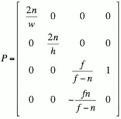
- but even then expressing things terms `w`,`h` is usually how these kind of matrices are expressed.
    - usually there's a **field of view (FOV)** expressed in either radians or degrees, in order to find the width, defined in vertical direction.
    - and then a **aspect radio** defined in order to find the width.
        - aspect radio = Width/Height
    - 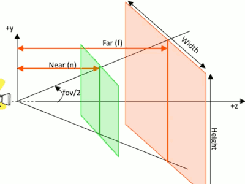
- 
    ```math
    tan(ɑ/2) = (h/2)/n = h/(2n)

    ⇒ 2n/h = 1/tan(ɑ/2)

    r = w/h

    ⇒ 2n/(w/r) = 1/tan(ɑ/2)
      2n·r/w = 1/tan(ɑ/2) 
      2n/w = 1/r · 1/tan(ɑ/2)
    ```

- LHS
    - 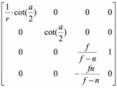
    - In Direct3D: D3DXMatrixPerspectiveFovLH(*p, a,r,n,f)
    - In Unity:Matrix4x4.Perspective(a,r,n,f)
- RHS
    - 
    - In Direct3D: D3DXMatrixPerspectiveFovRH(*p, a,r,n,f)
    - In XNA:Matrix.CreatePerspectiveFieldOfView( a,r,n,f )
    - In OpenGL: gluPerspective(a,r,n,f)

## Custom projections in Unity

- https://docs.unity3d.com/ScriptReference/Camera-projectionMatrix.html
- From Camera.projectionMatrix documentation:
    > If you change this matrix, the camera no longer updates its rendering based on its fieldOfView. This lasts until you call ResetProjectionMatrix.
    > Use a custom projection only if you really need a non-standard projection.
    > This property is used by Unity's water rendering to setup an *oblique projection* matrix.
    > Using custom projections requires good knowledge of transformation and projection matrices.

## Viewport transformation

- The actuall 2D projection to the viewer
- Copy to your back buffer (frame buffer)
- Can be programmed, scaled, ...


## Unity's coordinates systems ( conventions )

- Viewport space
    - (0,0) is bottom-left
    - (1,1) is top-right
- Screen space coordinates
    - z "is in world units from the camera"
    - (0,0) is bottom-left
    - (Camera.pixelWidth, Camera.pixelHeight) is top-right
- GUI space coordinates
    - (0,0) is upper-left
    - (Camera.pixelWidth, Camera.pixelHeight) is bottom-right


