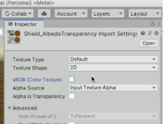
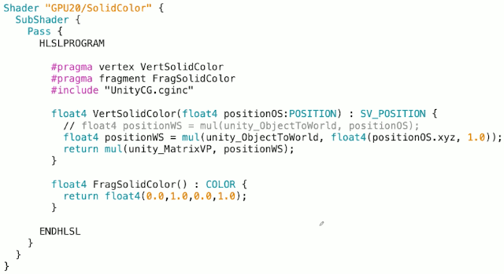
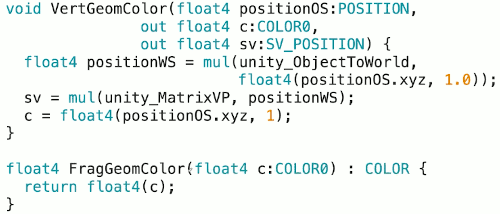

...menustart

- [GPU Programming for Video Games, Summer 2020, Georgia Tech](#b369fffc612dbbb4c7a6dfa31d084ab0)
- [14 Introduction to (HLSL) High-Level Shading Language](#640ce87faf3d5bbd816740f99655c884)
    - [HLSL/Cg](#4d18d595565b0d2c8e13586eea6120c3)
    - [Uniform vs. variable input](#f14670e8b29cfcddb95f5dcb68d09c39)
    - [The uniform type qualifier](#f5d547a4df5274d80f3da819251d801d)
    - [Semantics](#760627a893b77540e508cd43221cf13d)
    - [Math operations](#d809a16a14bf61bd6d8fb3803627b5a7)
    - [Standard library functions](#022d7df864dce645df3fefddc9097864)
- [15 Unity's Built-In Shader Source Code](#c1f35329b735fce8051e7058eb4223c6)
- [16 Preview of the IntroShaders UnityPackage](#a4299077a75fc0fe56c046cbdbc5f063)
- [18: Shaders + Parameters = Materials](#bb68527ba79c48b602ceace5abf2d610)
- [19: Unity Pipelines: Built-In vs. Scriptable](#c5e0304c0d974669bad4842d4ae9a22a)
    - [Unity's Render Pipelines](#01b872777f6a90374fc07819bbcb725d)
- [20: Simple Unlit Shaders](#0b4f9566f02921f54ee5420f78454d66)

...menuend


<h2 id="b369fffc612dbbb4c7a6dfa31d084ab0"></h2>


# GPU Programming for Video Games, Summer 2020, Georgia Tech


<h2 id="640ce87faf3d5bbd816740f99655c884"></h2>


# 14 Introduction to (HLSL) High-Level Shading Language

<h2 id="4d18d595565b0d2c8e13586eea6120c3"></h2>


## HLSL/Cg

- A C-like languge and syntax
- But generally does **NOT** have
    - Pointers
    - Dynamic memory allocation (heap)
    - Complex flow control
        - fixed size loops for SM 2.0 or earlier
    - Call stack
        - functions are often inlined; no practical recursion

<h2 id="f14670e8b29cfcddb95f5dcb68d09c39"></h2>


## Uniform vs. variable input

- Two different **input** data types in shader code
- **uniform** ( a keyword in HLSL/Cg) input:
    - global, does not change per vertex
    - Outside the scope of the shader function
    - Define at the beginning of the shader code
        - outside function
    - Don't need to explicitly write **uniform**
        - as long as you're defining variables outside the functions which you have to for uniform variables
- Variable input
    - Attributes associated with each vertex or pixel
        - these are basically the big buffers of vertices that are being sent from your main memory into the GPU.  these are also various things like the locations and colors of pixelds being created by your interpolator.
    - Declared using **semantics**


<h2 id="f5d547a4df5274d80f3da819251d801d"></h2>


## The uniform type qualifier

- A uniform variable value comes from an external source
    - your custom c++ DirectX or OpenGL game
    - Your C# XNA or MonoGame application
    - The unity or unreal 4 runtime , or your custom script
- Stored in a constant register (e.g., c0, read-only) in the GPU
- Same for all processed vertices or pixels in the entire shading process


<h2 id="760627a893b77540e508cd43221cf13d"></h2>


## Semantics

- Something not in usual C/C++ programming [Unity Sementics Doc](https://docs.unity3d.com/Manual/SL-ShaderSemantics.html)
- When writing HLSL shader programs, input and output variables need to have their “intent” indicated via semantics. 
    - This is a standard concept in HLSL shader language. [MSDN](https://docs.microsoft.com/en-us/windows/win32/direct3dhlsl/dx-graphics-hlsl-semantics?redirectedfrom=MSDN)
- A colon and a keywoard, e.g., 
    ```cg
    VertexPos: POSITION
    VertexColor: COLOR0
    VertexNormal: NORMAL
    VertexUVcoord: TEXCOORD0
    ```
- A **glue** that
    - Binds a shader program to the rest of the graphics pipeline
    - Connects the semantic variables to the pipeline

<h2 id="d809a16a14bf61bd6d8fb3803627b5a7"></h2>


## Math operations

- Most commonly used C/C++ operations are suported
- No pointer support or indirection in Cg/HLSL, so no `*` or `->`
- Some ops in Shader Model 4 and higher only:
    - Bitwise logic operation ( `&,^,|,&=,...` )
    - shift: `<<,>>, <<=,>>=`
    - Modular: %
    - (I can't recall seeing any examples of shader code used for 3D graphcs that uses those bit operations)


<h2 id="022d7df864dce645df3fefddc9097864"></h2>


## Standard library functions 

- dot(a,b)
- cross(a,b)
- distance(pt1,pt2) : Euclidean distance
- leap(a,b,f) : r = (1-f)*a + f*b
- lit(NL, NH, pwr) : for Blinn-Phong diffuse and specular lighting
- mul(M, N)
- normalize(v)
- saturate(a) : clamp to values between 0 and 1
- reflect( I, N) : calculate reflection vector of ray I
- sincos(x, s, c) : calculate sin(x) and cos(x), x is the input, s & c are outputs


<h2 id="c1f35329b735fce8051e7058eb4223c6"></h2>


# 15 Unity's Built-In Shader Source Code


1. google: `unity archive` , find `Unity - Download Archive`
    - unity provides the source code to all of its various built-in shaders , although the shader code is embedded inside the unity executable the acutal source code needs to be download separately.
2. pick a unity version, from the drop-list, choose `Built in Shaders` to download


<h2 id="a4299077a75fc0fe56c046cbdbc5f063"></h2>


# 16 Preview of the IntroShaders UnityPackage

https://catlikecoding.com/unity/tutorials/

Unity Store Assets

Fantasy Sword and Shield

Comeback


<h2 id="bb68527ba79c48b602ceace5abf2d610"></h2>


# 18: Shaders + Parameters = Materials 

- A materials is a combination of a shader and a set of parameters.
- Assets/Texture
    - generally, you  may want unclick "sRGB(Color Texture)"
    - 

<h2 id="c5e0304c0d974669bad4842d4ae9a22a"></h2>


# 19: Unity Pipelines: Built-In vs. Scriptable

<h2 id="01b872777f6a90374fc07819bbcb725d"></h2>


## Unity's Render Pipelines

- Built-in pipelines:
    - Forward Rendering
        - basically the kind of rasterization model 
    - Deferred Shading
        - a little bit more complicated, it basically pre-computes various kinds of lighting informations, stores that in the buffer,  and then runs a special shader that run through all individual pixels after the fact to figour out how the lighting should actually work.
    - Legacy Defferred Lighting
    - Legacy Vertex Lit
- Scriptable Render Pipelines:
    - Universal Render Pipeline ( formerly lightweight , LWRP )
        - can scale up and down ( for mobiles )
    - High-Definition Render Pipeline ( HDRP )
    - Your own custom pipeline !


<h2 id="0b4f9566f02921f54ee5420f78454d66"></h2>


# 20: Simple Unlit Shaders 

Fixed Color Shader

- Always ensure use of linear colorspace
- 
- the actual HLSL is between `HLSLPROGRAM` and `ENDHLSL`
    - in some older shader examples for unity , you'll probably see `CGPROGRAM` `ENDCG` instead of `HLSL`
    - all other stuffs outside here is not acutally part of HLSL, this is unity's specific. This is all meta stuff that tells unity how to organize the code.
    - this shader has just 1 subshader , and 1 pass.
- any shader you write for unity, you will want to include `UnityCG.cginc`
- what will admittedly make you confusing if you write your own engine or somebody else's engine besides unity is that there's a lot of variables that we're going to use that unity will define for you.
    - e.g.  `unity_ObjectToWorld`, `unity_MatrixVP`. 
    - anyways if you were not using unity's rendering routines that fill in these variables for you and passes into GPU from the CPU side, you would have to actually put in your c#  script and explicitly create these matrices on the CPU side and then send them into the GPU.
    - here the unity runtime is handling that for you behind the scenes.
- the `pragma` is designed to tell the compiler what's the vertex shader , and what's the fragment shader.
- `return mul(unity_MatrixVP, positionWS);`
    - notice in here , there's no place we're dividing by w ( value z ), that's handled by other hardware on the card.

--- 

- Alternative style , without return value
    - 

- So far the pixel shader I've showed you haven't taken any parameters. Here we are going to take in a color parameter. 
    - 
    - `c = float64( positionOS.xyz, 1);`
        - this is a little weird. typically use something like this is as a bit of diagnostic to try to visualize what my geometry data is , and make sure it's being interpreted correctly.
- since we have 2 output , we have to use this "out convention".
- Note: the color `out c` in VertGeomColor , is not directly passed in FragGeomColor. The color that are being passed in to the pixel shader are the interpolated colors.
    - The fact that we have the `COLOR0` in vertex shader matching the `COLOR0` in fragment shader ,  the samantics hook to the interpolation hardware and make that connection.


