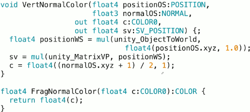
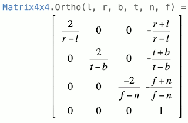
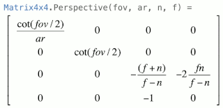
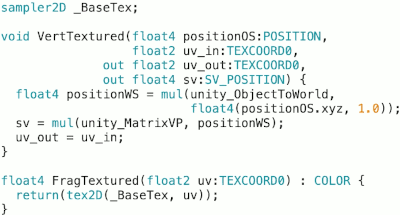
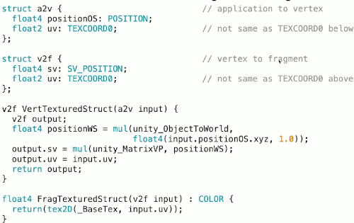
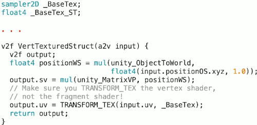

[](...menustart)

- [GPU Programming for Video Games, Summer 2020, Georgia Tech](#b369fffc612dbbb4c7a6dfa31d084ab0)
- [14 Introduction to (HLSL) High-Level Shading Language](#640ce87faf3d5bbd816740f99655c884)
    - [HLSL/Cg](#4d18d595565b0d2c8e13586eea6120c3)
    - [Uniform vs. variable input](#f14670e8b29cfcddb95f5dcb68d09c39)
    - [The uniform type qualifier](#f5d547a4df5274d80f3da819251d801d)
    - [Semantics](#760627a893b77540e508cd43221cf13d)
    - [Math operations](#d809a16a14bf61bd6d8fb3803627b5a7)
    - [Standard library functions](#022d7df864dce645df3fefddc9097864)
- [15 Unity's Built-In Shader Source Code](#c1f35329b735fce8051e7058eb4223c6)
- [16 Preview of the IntroShaders UnityPackage](#a4299077a75fc0fe56c046cbdbc5f063)
- [18: Shaders + Parameters = Materials](#bb68527ba79c48b602ceace5abf2d610)
- [19: Unity Pipelines: Built-In vs. Scriptable](#c5e0304c0d974669bad4842d4ae9a22a)
    - [Unity's Render Pipelines](#01b872777f6a90374fc07819bbcb725d)
- [20: Simple Unity Shaders](#42e4c37e0ed140aeca92fc113f12f40d)
    - [Unity's Projection Matrix](#8275ed10e209ddff1893ccf75682b95f)
- [21: Accessing Textures in Shader Code](#bbd0bca758543337c8276bfef9328cd5)
    - [Textured "Shader"](#b116226b410e39ca08a8cf99007d3697)
    - [Using Structure](#c37e330bcb24bdaf1d5c6fe156c99c87)
    - [Tiling and Offseting Texture](#16f72d243b711fb98bdc0296a421fb4e)
- [22: Normal Vector Transformations](#5b1ba11f6ae6576256afc26bbe7b3047)
    - [Trouble with transforming normals](#256d8ad6a01f5f472dfee1ebc9399dc6)
    - [Transforming normals](#25c055fba3cd4ed8375e0b4b08b9e25c)

[](...menuend)


<h2 id="b369fffc612dbbb4c7a6dfa31d084ab0"></h2>

# GPU Programming for Video Games, Summer 2020, Georgia Tech


<h2 id="640ce87faf3d5bbd816740f99655c884"></h2>

# 14 Introduction to (HLSL) High-Level Shading Language

<h2 id="4d18d595565b0d2c8e13586eea6120c3"></h2>

## HLSL/Cg

- A C-like languge and syntax
- But generally does **NOT** have
    - Pointers
    - Dynamic memory allocation (heap)
    - Complex flow control
        - fixed size loops for SM 2.0 or earlier
    - Call stack
        - functions are often inlined; no practical recursion

<h2 id="f14670e8b29cfcddb95f5dcb68d09c39"></h2>

## Uniform vs. variable input

- Two different **input** data types in shader code
- **uniform** ( a keyword in HLSL/Cg) input:
    - global, does not change per vertex
    - Outside the scope of the shader function
    - Define at the beginning of the shader code
        - outside function
    - Don't need to explicitly write **uniform**
        - as long as you're defining variables outside the functions which you have to for uniform variables
- Variable input
    - Attributes associated with each vertex or pixel
        - these are basically the big buffers of vertices that are being sent from your main memory into the GPU.  these are also various things like the locations and colors of pixelds being created by your interpolator.
    - Declared using **semantics**


<h2 id="f5d547a4df5274d80f3da819251d801d"></h2>

## The uniform type qualifier

- A uniform variable value comes from an external source
    - your custom c++ DirectX or OpenGL game
    - Your C# XNA or MonoGame application
    - The unity or unreal 4 runtime , or your custom script
- Stored in a constant register (e.g., c0, read-only) in the GPU
- Same for all processed vertices or pixels in the entire shading process


<h2 id="760627a893b77540e508cd43221cf13d"></h2>

## Semantics

- Something not in usual C/C++ programming [Unity Sementics Doc](https://docs.unity3d.com/Manual/SL-ShaderSemantics.html)
- When writing HLSL shader programs, input and output variables need to have their “intent” indicated via semantics. 
    - This is a standard concept in HLSL shader language. [MSDN](https://docs.microsoft.com/en-us/windows/win32/direct3dhlsl/dx-graphics-hlsl-semantics?redirectedfrom=MSDN)
- A colon and a keywoard, e.g., 
    ```cg
    VertexPos: POSITION
    VertexColor: COLOR0
    VertexNormal: NORMAL
    VertexUVcoord: TEXCOORD0
    ```
- A **glue** that
    - Binds a shader program to the rest of the graphics pipeline
    - Connects the semantic variables to the pipeline
- Semantics（语义）是HLSL中变量与众不同的一个地方
    - 在编写HLSL shader程序时，输入输出变量需要通过语义(semantics)来表明它们的意图，这是hlsl语言的一个标准概念。
    - 它用来描述变量的一些信息
    - 本质上语义是规定着色器变量与硬件之间的关系, 例如POSITION指定这个变量是被用在位置相关的寄存器。
    ```hlsl
    v2f vert (
        float4 vertex : POSITION, // vertex position input
        float2 uv : TEXCOORD0 // first texture coordinate input
        )
    {
        ...
    ```


语义 | which shader | comments
:--- | :---: | ---
POSITION | vert | 输入：Vertex position in object space. <br>输出: Position of a vertex in homogenous space. Compute position in screen-space by dividing (x,y,z) by w. Every vertex shader must write out a parameter with this semantic.
SV_Target  | frag | 片元着色器一般会输出一个颜色，并带有SV_Target语义。 <br>`fixed4 frag (v2f i) : SV_Target` 
SV_TargetN | frag | 多个渲染目标，SV_Target1、SV_Target2等等。 SV_Target0等同于SV_Target。
SV_Depth | frag | 片元着色器深度输出, 通常情况下， 片元着色器不会覆盖 Z 缓冲区值。但是， 对于某些效果，输出每个像素的自定义 Z 缓冲区深度值很有用。<br>请注意，在许多 GPU 上，这会关闭一些深度缓冲区优化。
SV_POSITION | vert,frag | 指示顶点在裁剪空间中的位置，以便GPU知道屏幕上的栅格化位置和深度。
TEXCOORD0, TEXCOORD1 |  vert,frag | 用于指示任意高精度数据，如纹理坐标和位置。
COLOR0, COLOR1 | vert(out),frag(in) | 用于低精度 0 到 1 范围的数据（如简单的颜色值）。
VPOS | frag | 屏幕空间像素位置
VFACE | frag | 片元着色器可以接收一种指示渲染表面是面向摄像机还是背对摄像机的变量。在渲染两侧可见的几何体时非常有用，通常用于树叶或类似的薄片物体。<br>VFACE语义修饰的变量如果是整数表示渲染的面片是正面，否则表示反面。
SV_VertexID | vert | 顶点着色器可以接收具有“顶点编号”（为无符号整数）的变量。当您想要从纹理或ComputeBuffers中 获取额外的每顶点数据时，这非常有用。<br>此功能从 DX10（着色器模型 4.0）和 GLCore/OpenGL ES 3 开始才存在，因此着色器需要具有`#pragma target 3.5`编译指令。


<h2 id="d809a16a14bf61bd6d8fb3803627b5a7"></h2>

## Math operations

- Most commonly used C/C++ operations are suported
- No pointer support or indirection in Cg/HLSL, so no `*` or `->`
- Some ops in Shader Model 4 and higher only:
    - Bitwise logic operation ( `&,^,|,&=,...` )
    - shift: `<<,>>, <<=,>>=`
    - Modular: %
    - (I can't recall seeing any examples of shader code used for 3D graphcs that uses those bit operations)


<h2 id="022d7df864dce645df3fefddc9097864"></h2>

## Standard library functions 

- dot(a,b)
- cross(a,b)
- distance(pt1,pt2) : Euclidean distance
- leap(a,b,f) : r = (1-f)*a + f*b
- lit(NL, NH, pwr) : for Blinn-Phong diffuse and specular lighting
- mul(M, N)
- normalize(v)
- saturate(a) : clamp to values between 0 and 1
- reflect( I, N) : calculate reflection vector of ray I
- sincos(x, s, c) : calculate sin(x) and cos(x), x is the input, s & c are outputs


<h2 id="c1f35329b735fce8051e7058eb4223c6"></h2>

# 15 Unity's Built-In Shader Source Code


1. google: `unity archive` , find `Unity - Download Archive`
    - unity provides the source code to all of its various built-in shaders , although the shader code is embedded inside the unity executable the acutal source code needs to be download separately.
2. pick a unity version, from the drop-list, choose `Built in Shaders` to download


<h2 id="a4299077a75fc0fe56c046cbdbc5f063"></h2>

# 16 Preview of the IntroShaders UnityPackage

https://catlikecoding.com/unity/tutorials/

Unity Store Assets

Fantasy Sword and Shield

Comeback


<h2 id="bb68527ba79c48b602ceace5abf2d610"></h2>

# 18: Shaders + Parameters = Materials 

- A materials is a combination of a shader and a set of parameters.
- Assets/Texture
    - generally, you  may want unclick "sRGB(Color Texture)"
    - 

<h2 id="c5e0304c0d974669bad4842d4ae9a22a"></h2>

# 19: Unity Pipelines: Built-In vs. Scriptable

<h2 id="01b872777f6a90374fc07819bbcb725d"></h2>

## Unity's Render Pipelines

- Built-in pipelines:
    - Forward Rendering
        - basically the kind of rasterization model 
    - Deferred Shading
        - a little bit more complicated, it basically pre-computes various kinds of lighting informations, stores that in the buffer,  and then runs a special shader that run through all individual pixels after the fact to figour out how the lighting should actually work.
    - Legacy Defferred Lighting
    - Legacy Vertex Lit
- Scriptable Render Pipelines:
    - Universal Render Pipeline ( formerly lightweight , LWRP )
        - can scale up and down ( for mobiles )
    - High-Definition Render Pipeline ( HDRP )
    - Your own custom pipeline !


<h2 id="42e4c37e0ed140aeca92fc113f12f40d"></h2>

# 20: Simple Unity Shaders 

Fixed Color Shader

- Always ensure use of linear colorspace
- 
- the actual HLSL is between `HLSLPROGRAM` and `ENDHLSL`
    - in some older shader examples for unity , you'll probably see `CGPROGRAM` `ENDCG` instead of `HLSL`
    - all other stuffs outside here is not acutally part of HLSL, this is unity's specific. This is all meta stuff that tells unity how to organize the code.
    - this shader has just 1 subshader , and 1 pass.
- any shader you write for unity, you will want to include `UnityCG.cginc`
- what will admittedly make you confusing if you write your own engine or somebody else's engine besides unity is that there's a lot of variables that we're going to use that unity will define for you.
    - e.g.  `unity_ObjectToWorld`, `unity_MatrixVP`. 
    - anyways if you were not using unity's rendering routines that fill in these variables for you and passes into GPU from the CPU side, you would have to actually put in your **c# script** and explicitly create these matrices on the CPU side and then send them into the GPU.
    - here the unity runtime is handling that for you behind the scenes.
- the `#pragma` is designed to tell the compiler what's the vertex shader , and what's the fragment shader.
- `float4(positionOS.xyz, 1.0);` just hints the compiler to do some possible optimization.
- `return mul(unity_MatrixVP, positionWS);`
    - notice in here , there's no place we're dividing by w ( value z ), that's handled by other hardware on the card.

--- 

- Alternative style , without return value
    - 

- So far the pixel shader I've showed you haven't taken any parameters. Here we are going to take in a color parameter. 
    - 
    - `c = float64( positionOS.xyz, 1);`
        - this is a little weird. typically use something like this is as a bit of diagnostic to try to visualize what my geometry data is , and make sure it's being interpreted correctly.
- since we have 2 output , we have to use this "out convention".
- Note: the color `out c` in VertGeomColor , is not directly passed in FragGeomColor. The color that are being passed in to the pixel shader are the interpolated colors.
    - The fact that we have the `COLOR0` in vertex shader matching the `COLOR0` in fragment shader ,  the samantics hook to the interpolation hardware and make that connection.

---

- NormalColor (HLSL)
    - 


<h2 id="8275ed10e209ddff1893ccf75682b95f"></h2>

## Unity's Projection Matrix

- 
- 


<h2 id="bbd0bca758543337c8276bfef9328cd5"></h2>

# 21: Accessing Textures in Shader Code

<h2 id="b116226b410e39ca08a8cf99007d3697"></h2>

##  Textured "Shader"

- 
- `Properties`
    - these represent variables that you can assign in the unity inspector
    - the variable name you see here `_BaseTex` , this is the veriable you can use in the actual HLSL program.
        - the under score is not necessary, but unity has a convertion of putting an underscore on these properties.
    - `"Base (RGB)"` this string is how this propery will be labeled in the unity inspector.
    - `2D` describes the type of this property.
    - `"white"` sets up a default
    - `{}`   maybe options could go in there, but I don't think I've ever seen anybody actually put stuff in here.
- 
    - `sampler2D _BaseTex;` declaration, declaring the `_BaseTex` variable, this uniform variable, to be a sampler2D which basically means this is a 2D texture.
        - it should be declared properly, because you have speificy it's type as `2D`  in Properties.


<h2 id="c37e330bcb24bdaf1d5c6fe156c99c87"></h2>

## Using Structure

- 
- this code does the exactly same thing except we have introduced the use of structures.

<h2 id="16f72d243b711fb98bdc0296a421fb4e"></h2>

## Tiling and Offseting Texture

- If you want to add offset to uv's of the texture, or repeate the texture
    - 
    - 
    - `TRANSFORM_TEX` this is annoyingly quite unity specific.
        - the unity shader compiler would like you to take all of your texture variable name (`_BaseTex`) and create a float4 variable that has `_ST` appended at the end ( `_BaseTex_ST` ).
        - and there is an macro, a uv texture coordinate, and the texture you want to look up
            ```c
            #define TRANSFORM_TEX( tex, name ) ( tex.xy * name##_ST.xy + name##_ST.zw )
            ```


<h2 id="5b1ba11f6ae6576256afc26bbe7b3047"></h2>

# 22: Normal Vector Transformations 

<h2 id="256d8ad6a01f5f472dfee1ebc9399dc6"></h2>

## Trouble with transforming normals

- transforming normals, just applying the rotation but not the translation to the vertices position, seems almost works.
    - but what messed up is scaling. if you scales your x,y,z direction the same , then that's fine. 
    - but if you apply different amount on different direction, you will got problem.
    - so you have to tweak things make it right.
    - 

<h2 id="25c055fba3cd4ed8375e0b4b08b9e25c"></h2>

## Transforming normals

Only using upper left 3x3 part of the 4x4 matrix.

- say, a point on a surfapce represents as vector t.  A linear transform M is applied on it. `tM`
- to keep the normal still perpendicular to t,  we need apply some transform on the normal as well
    ```
    (Wn)·(Mt) = 0
    (Wn)ᵀ(Mt) = 0 // dot product -> matrix mul
    (nᵀWᵀ)(Mt) = 0 
    nᵀ(WᵀM)t = 0 
    sine nᵀt = 0, we can set WᵀM = I
    MᵀW = Iᵀ
    W = (Mᵀ)⁻¹
    ```
- so to transform a normal,  you take the same matrix that you used to transform the vertices, you grab the upper left 3x3 part, and then you take its inverse transpose.
- as mentioned before, if M has only rotation, under those condition, the inverse transform of that kind of matrix is just the transpose of the matrix, so W = (Mᵀ)⁻¹ = M. but that is only for that special case.


