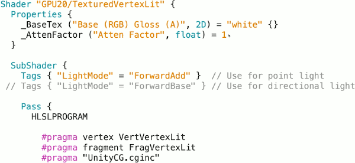

# 23: Simple Lit Shaders

- note
    - VertexLight  只计算顶点的光照，其他靠GPU插值
    - PixelLight   法线 经过插值，分别计算每个点的光照，更加细腻真实

## Diffuse Light Only Shader

- 
    - per-vertex lighting
    ```cpp
    _AttenFactor("Atten Factor", float) = 1
    ```
        - attenuation factor to control how the intensity of the light falls off with range.

    - SubShader / Tags
        - the "LightMode" tag indicates certain kinds of bits of shader code that the unity render function will run at different points.
        - I don't want to get into too much detail here about what these mean. Basically there's a single directional light that's computed as part of what's called "ForwardBase" pass that includes some other things. And then any additional directional lights and any point lights are computed in these additional "ForwardAdd" runs. 
        - If I wanted to make this more robust I would actually have two copies of the sahder code here with minor tweaks , one for the "ForwardAdd" and one for the "ForwardBase". But here I'm just going to say, oh since ths is a demo example and I want to make the code as compact as possible, just comment in or out whichever one you want based on whichever light you're using.


## VertexLit & PixelLit Uniforms 

```c
sampler2D _BaseTex;
float4 _BaseTex_ST;

float _AttenFactor;

// Unity fills for us
float4 _LightColor0;
```

- There's something a little strange in the actual HLSL uniform variable declarations: Most of the unity side variables that we use, such as the transformation matrices, are automatically grabbed by Unity in one of the include files, there's  a `_LightColor0` variable that Unity fills in for us , this is not part of those include files. It might be deprecated and removed in a further version ?


## VertexLit Structures

```c
struct a2v {
    float4 positionOS: POSITION:
    float3 normalOS: NORMAL;
    float2 uv: TEXCOORD0 ;
};

struct v2f {
    float4 sv: SV_POSITION; 
    flaot2 uv: TEXCOORD0 ;
    float3 diffAlomost: TEXCOORD1 ;
}
```

- something interesting here is the vertex shader is going to send some results of a lighting calculation. I call it `diffAmost` because it doesn't include the actual image texture information, but the overall light intensity is computed here.  
- And we're going to transmit that information through `TEXCOORD1`.  We're using a texture coordinate register to transmit information that's not actually a texture coordinate. We're gonna to a lot of this and you just need to get used to it.


## VertexLit ( Vertex Shader )

- 
- To transform normals, we want to use the inverse transpose of upper left 3x3 matrix
    - W = (Mᵀ)⁻¹
    - unity actually has an inverse matrix computed already for us on the inverse side `unity_WorldToObject` , so we're not having to constantly  redo that in the shader code.
    - so n' = `unity_WorldToObjectᵀ`n 
    - (n')ᵀ = nᵀ`unity_WorldToObject`  , (n')ᵀ and n' are same in that float3 representation.
    ```c
    float3 normalWS = normalize(  
        mul( input.normalOS, (float3x3)unity_WorldToObject )
    );
    ```
- another unity specific thing is that  unity is going to fill in this `_WorldSpaceLightPos0` for us, which, if you have apoint light unsurprisingly is the position of the light in world space. 
    - But unity does a clever thing, it uses this variable in 2 different ways. It can be either be the postion of the point light , or it can be the position of the directional light.
        - `_WorldSpaceLightPos0.w` = 0, directional light
        - `_WorldSpaceLightPos0.w` = 1, point light
    ```c
    float3 unNormLightDir = _WorldSpaceLightPos0.xyz - positionWS.xyz * _WorldSpaceLightPos0.w ;
    ```
- so the reason I call this `diffAlmost` is it doesn't have the final application of the actual texture image that's something we have to do in pixel shader. So it's not quite the diffuse light calculation yet, it's almost.
    - this `diffAlmost` is something I want to pass into the pixel shaders through the interpolation hardware.


## VertexLit ( Pixel Shader)

- 


## PixelLit Structure

```c
struct a2v {
    float4 positionOS: POSITION:
    float3 normalOS: NORMAL;
    float2 tc: TEXCOORD0 ;
};

struct v2f {
    float4 sv: SV_POSITION; 
    flaot2 uv: TEXCOORD0 ;
    float3 positionWS: TEXCOORD1 ;
    float3 normalWS: TEXCOORD2 ;
}
```

- The overall structure is pretty similar.
    - but what I'm passing along to the pixel shader is different. 
    - I'm still passing along the texture coordinate for later texture lookup.
    - Now because I'm doing so much of the lighting in pixel shader, I'm not passing the lighting calculation like the `diffAlmost` I computed in the per-vertex shader. I'm going to pass along the clip space postion `sv`,  positon of the point in world space, and I'm also going to pass along the normal in world space.


## PixelLit (Vertex Shader)

- 

## PixelLit (Pixel Shader)

- 

- the interpolation hardware doesn't know that you hijacked one of the texture coordinate registers to hold something that's not a texture coordinate. It doesn't know that the normal vectors need to be normalized to have unit length.
    ```c
    // renormalizeing because the GPU's interpolator
    // doesn't know this is a unit vector
    float3 n = normalize( input.normalWS) ;
    ```

# 24: Normal Mapping


