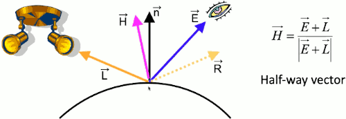
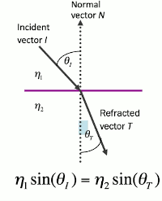
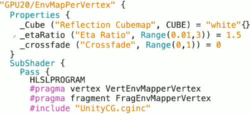
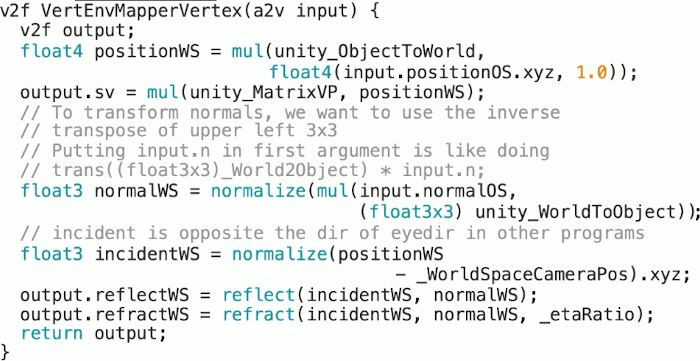
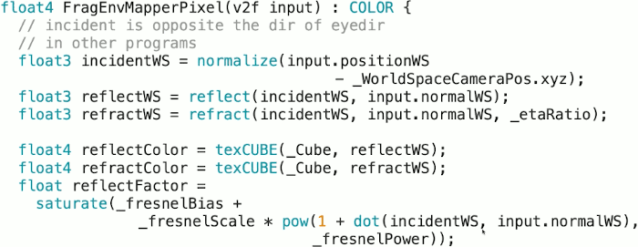

# 25: Environment Mapping

- If you want an accurate simulation of those kind of effects ( e.g. reflection ) you need to go to something like ray tracing.

## Vector Notation

- 


- what's a little bit confusing is that in this lecture, we're mostly going to want to be **reflecting the eye vector**.


## Reflection

- N needs to be normalized
- R has same length as L
    - R = L - 2N(N·L)
- fortunately there is a command built into most shading languages
    - R = reflect( L,N ) 


## Cube Maps

- The way we're going to fake reflection effects is using a cube map.
- The reflection that we're seeing depends on the eye position.
- to lookup a cube map:
    - `texCUBE( (samplerCUBE) envMap, (float3)vec )`
    - the 2nd parameter `vec` doesn't need to be normalized.

## Refraction

- in addition to reflection effects, we can also use cube maps for refraction effects, where we're imagining that the object is translucent and we're seeing light waves from things on the other side but they're distorted a bit because those light waves are being bent as they're going through the surface.
- 
    - T = refract( I, N, etaRatio )
    - etaRatio = η₁ / η₂ 
        - η₁ , η₂ is the index of refraction


## Different indices of refraction

- Vacuum: 1.0
- Air: 1.0003
- Water: 1.333
- Glass: 1.5 (ordinary window glass)
- Plastic: 1.5
- Diamond: 2.417
- Data from "The Cg Tutorial", p.184


## EnvMap ( per vertex ) -- setup

- 
- `_Cube ("Reflection Cubemap", CUBE )` = "white" {}
- for this shader, I created a `_crossfade` slider that lets you crossfade between a pure reflection effect and a pure refraction effect.


## EnvMap ( per vertex ) -- structures

```c
samplerCUBE _Cube;
float _etaRatio;
float _crossfade;

struct a2v { // application to vertex
    float4 positionOS: POSITION;
    float3 normalOS: NORMAL;
}; 

struct v2f { // vertex 2 fragment
    float4 sv: SV_POSITION;
    float3 reflectWS: TEXCOORD0;
    float3 refractWS: TEXCOORD1;
};
```

## EnvMap ( per vertex ) -- Vertex Program

- 
- we're going to compute the incident light vector that's pointing from where the camera is to the vertex
    ```c
    // incident is opposite the dir of eyedir in other programs
    float3 incidentWS = normalize(
        positionWS - _WorldSpaceCameraPos ).xyz; 
    ```
- and then we use the `reflect` and `refract` command to find the reflected and refracted vector
    ```c
    output.reflectWS = reflect( incidentWS, normalWS ) ;
    output.refractWS = refract( incidentWS, normalWS, _etaRatio );
    ```


## EnvMap ( per vertex ) -- Fragment Program

- 
- `texCUBE` don't care about whether the 2nd parameter is unit vector, it cares about only the direction.
- `lerp(reflectColor, refractColor, _corrsfade)`
    - linearly interpolate between those 2 colors it looks up depending on `_crossfade`
- per-vertex shader creates some problems with some clearly visible artifacts.
    - 

## Fresnel effect 

before we look at the per pixel code, I want to talk about an effect that I added to the per-pixel code.

- from "The Cg Tutorial" p.189
- Fresnel effect
    - Some light reflects and some refracts
    - Think about looking into water
        - At shallow angles, a lot of reflection and little refraction
        - Looking straight in, a lot of refraction and a little reflection
    - Empirical approximation: I = -E
        - remember that the incident vector for whatever historical reason is defined as being opposite of our usual Eye vector. So I is pointing from the camera to the surface instead of the other way around.
        - reflectCoeff = max( 0, min( 1, bias+scale(1 + I·n )<sup>power</sup> ) )
        - C<sub>final</sub> = reflectCoeff x C<sub>reflected</sub> + ( 1-reflectCeoff)C<sub>refracted</sub>
        - comments
            - bias, scale, power are parameters you can use to adjust this effect.
            - you get a reflect coefficient in [0,1] that you use to interpolate between the reflected and refracted colors ( C<sub>reflected</sub> & C<sub>refracted</sub> ) .

- 
    - 3 new properties: _fresnelBias , _fresnelScal, _fresnelPower
    - `Toggle`
        - will actually create a little checkmark box that will be filled with either 0 or 1, 0 means unchecked.
        - this is what I'm going to use to select a certain diagnostic mode that ignores all the cube lookups and just replaces them with a color blue and yellow.
        - this will give us a way to visualize the Fresnel reflect coefficient calculation.
    - `KeywordEnum`
        - drop-down menu
        - let us switch between using the original crossfade I already used in the per-vertex shader and the fancier Fersnel effect.
    - the way that you actually use the `Toggle` and `KeywordEnum` is by placing some `#pragma`  into your shader code
        ```c
        #pragma shader_feature BLUE_YELLOW
        #pragma multi_compile _BLEND_CROSSFADE _BLEND_FRESNEL
        ```
    - "\_BLEND" + "_" +  upcase( "Crossfade" )

## EnvMap ( per Pixel ) -- structures


```c
samplerCUBE _Cube;
float _etaRatio;
float _crossfade;
float _fresnelBias ; // new
float _fresnelScale ; // new
float _fresnelPower ; // new

struct a2v { // application to vertex
    float4 positionOS: POSITION;
    float3 normalOS: NORMAL;
}; 

struct v2f { // vertex 2 fragment
    float4 sv: SV_POSITION;
    float3 positionWS: TEXCOORD0;   // changed
    float3 normalWS: TEXCOORD1;     // changed
};
```

## EnvMap ( per Pixel ) -- Vertex Program

- 


## EnvMap ( per Pixel ) -- Fragment Program

- 
- 


