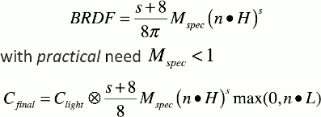
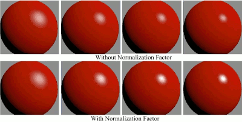
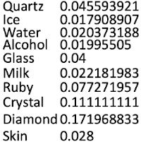
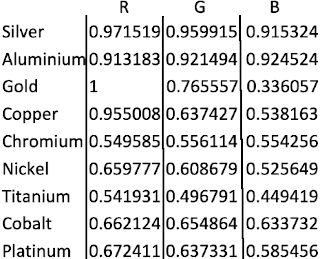
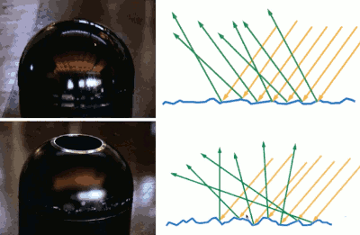
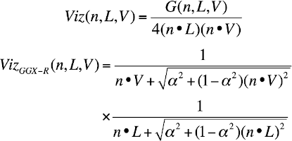
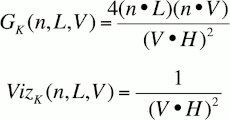

...menustart

- [29: Cook-Torrance Specular Models](#b04109b8e15bc84aca836e9bc09b152d)
    - [Elements of PBR](#478492620a2b50ba05eaee643241c6ce)
    - [Bidirectional Reflectance Functions](#f63e79ddbcbdce02ed201f40fb60bffa)
    - [BRDFs should have reciprocity](#8093013fcea1b701df30da4550c07a54)
    - [Modified Blin-Phong](#7d093096f231dc342a8e32f2258d21c5)
    - [Energy conservation](#34dc8a1028bce11fcd745854ad8fe827)
    - [A common yet confusing convention](#4746c0d5cdade73482f2ffb14f1ff1da)
    - [Normalized modified Blinn-Phong](#626a106a229043c181d5645dff603901)
    - [Combining specular and diffuse](#c3ad95f21e252d827f66df4c0ca1c340)
    - [Normalized specular helps your artists](#afb61fff0ece9f787102003cd372a359)
    - [Metals vs. dielectrics](#f8592700891f82e1523af1167b9a9587)
    - [Fresnel effect](#a6977b0b6db1f017d37ea6684915d2e0)
    - [F₀ for dielectrics(linear)](#10ecaa8a088af69327b428d655fe21f6)
    - [F₀ for metals (linear)](#e8ae1e9d34ec7a6c721b6e82eab2cac2)
    - [Incorporating Fresnel term](#ed566e90740a9c5838a9c5ab8fdda9c9)
    - [A reflective paradox ?](#80c161aa421f99484c1dc48af5db8bbc)
    - [General Cook-Torrance specular](#77f1b426a249ea2531db86d988e423f6)
    - [Blinn-Phong microfacet distribution](#ac1ce08fd7d9d47a82c152b77e4e1bf2)
    - [GGX microfacet distribution](#e2d12166a63a2ed94946f5ca71450dec)
    - [The geometric term](#c337a246bd4f9fed5de6d91371f0f1ee)
    - [Original Cook-Torrance geometric term](#2d344b726af21587cc454729ba80d3a1)
    - [GGX-based geometric term](#47fc78796de776d18d85cffe54df6887)
    - [GGX-matched to GGX geometric term](#026a7aa509ad6276afb039a40b54612a)
    - [Implicit geometric term](#0474a9b3b35d94709f0b805b242660c6)
    - [Kelemen Geometric term](#c7569ccd39eff40dd96ed8a171877ea2)

...menuend

<h2 id="b04109b8e15bc84aca836e9bc09b152d"></h2>

# 29: Cook-Torrance Specular Models

- most popular model for specular reflections and physically based rendering

<h2 id="478492620a2b50ba05eaee643241c6ce"></h2>

## Elements of PBR

- Linear space lighting
    - don't use gamma color space
- **Energy conservation**
    - unless you have a material that is emissive (i.e. it is its own light source) it can't be reflecting **more** energy than is coming in.
- **Reciprocity**
    - which says you need to be able to swap the viewer and the light source and get the same answer.
- Metallic/dielectric distinction
    - we're going to be using the term `dielectric` in a much more general sense, basically a dielectric is anything that's not metal.
- "Everything is shiny" (i.e. has specular)
- "Everything has Fresnel"
    - here we're using the term `fresnel` in a different way. It has the same ideas but we're going to be a little more specific about it, and essentially apply it to everything not just things that are refracting.
- Bonus: high definition render buffers and tonemapping to handle high dynamic range
    - now if you actually implement all of these above things and try to put in some realistic light sources and materials you will find that the kinds of light your camera is receiving will cover an extreme dynamic range.
    - previously when people weren't trying to go for physically based rendering they're just trying to go for something that looked decent, you would take a lot of time scaling your light sources to try to not blow out your image. But if you are trying to do something somewhat realistic you have to encapsulate the fact that you will have some very dim parts of your scene and some very bright parts of your scene.
    - so you may need a high definition render buffer that can handle this high dynamic range and then various techniques such as tone mapping or bloom to take that high dynamic range information and compress it into what can actually be shown on a display.

<h2 id="f63e79ddbcbdce02ed201f40fb60bffa"></h2>

## Bidirectional Reflectance Functions 

- For "punctal" lights ( typical point, directional , spotlight... )
    - Cfinal = Clight ⊗ πBRDF(L,V) max(0, n·L)
    - BRDF: bidirectional reflectance distribution function
    - L: light coming in
    - V: viewer
    - π: magic ...
    - ⊗: color-wise multiplication
        - multiply red by red, green by green, blue by blue
- Classic diffuse lighting model:
    - BRDF = Mdif / π
    - Cfinal = Clight ⊗ Mdif  max(0, n·L)
- Classic Blinn-Phong lighting model:
    - 
    - Cfinal = Clight ⊗ Mspec (n·H)s
    - H: unit half vector between the light vector and the viewing vector
    - unfortunately it's not physically plausible for a couple of reasons.

<h2 id="8093013fcea1b701df30da4550c07a54"></h2>

## BRDFs should have reciprocity

- Reciprocity means we can swap the incoming and outgoing light directions:
    - BRDF(L,V) = BRDF(V,L)
- Obviously true for classic diffuse lighting, because that's just a contant, doesn't have L or V in it anyway.
    - BRDF = Mdif / π
- Reciprocity does not hold for classic Blinn-Phong:
    - 
        - 
        - n·L ≠ n·V
    - so later when people introduced the idea of physically based rendering they thought how can we give it reciprocity. And the obivous thing to do is just drop the this denominator `/ n·L`

<h2 id="7d093096f231dc342a8e32f2258d21c5"></h2>

## Modified Blin-Phong

- BRDF = ( Mdif / π ) (n·H)s 
    - s parameter:  let us scale the width of the spot. 
        - if s is very small,  I get a broad peak , while if s is large, I get a narrow peak , because `n·H < 1`
- Cfinal = Clight ⊗ Mspec (n·H)s max(0, n·L)
- But there is a problem with this `s`. In general this `s` is not enery conservation. 

<h2 id="34dc8a1028bce11fcd745854ad8fe827"></h2>

## Energy conservation

- "Total amount of reflected light cannot be more than the amount of incoming light" -- Rory Driscoll
- For classic diffuse model BRDF = Mdif / π 
    - turns out you techinically nedd πMdif `< 1` ( need calculus to derive)
- since π is just a constant, "we usually just ignore it and assume that our lights are just π times too bright." -- Steve McAuley

<h2 id="4746c0d5cdade73482f2ffb14f1ff1da"></h2>

## A common yet confusing convention

- For classic diffuse model BRDF = Mdif / π 
    - We'll pretend you practically need Mdif `< 1`
- Convenient for artists: hit a diffuse surface with a materialo color of "1" with a directional light with an "intensity" of "1" parallel with its normal and you get "1"
- If you are implementing global illumination, be careful !
    - if you have something that's sending out more light than it's taking in when it's not supposed to that can cause your numeric solutions to freak out.

<h2 id="626a106a229043c181d5645dff603901"></h2>

## Normalized modified Blinn-Phong

- To achieve energy conservation
    - 
    - it turns out if you work through a bunch of multi-dimensional integrals you can figour out that if you stick this fact `(S+8)/(8Π)` out in front, then the reflected energy is going to be conserved as you change `s`.
    - and having this term `s+8` in the numerator means that as we shrink the sport , we're making that spot brighter.

<h2 id="c3ad95f21e252d827f66df4c0ca1c340"></h2>

## Combining specular and diffuse

- Combined BRDF:
    - 

<h2 id="afb61fff0ece9f787102003cd372a359"></h2>

## Normalized specular helps your artists

- 

<h2 id="f8592700891f82e1523af1167b9a9587"></h2>

## Metals vs. dielectrics

- Dielectrics have diffuse and specular reflections
    - Specular reflection is white
- Metals have purely specular reflections
    - specular reflection may be non-white
        - particularly if you're looking at them head on
    - Still white at large grazing angles.

<h2 id="a6977b0b6db1f017d37ea6684915d2e0"></h2>

## Fresnel effect

- Specular reflections increase dramatically at high grazing angles
- Schlick aporoximation:
    - F(V,H) = F₀ + (1-F₀)(1-**V**·H)⁵ 
        - = F₀ + (1-F₀)(1-**L**·H)⁵
    - F₀ : reflection when view and ligth vector align ( grey for dielectrics, but metals can have color )
    - since H is the half vector of L and V,  V·H == L·H
    - ( 1 - L·H )⁵ this gives us a really aggressive slope off near the edge.  Essentially this becomes an interpolation factor. 
- one thing that's confusing is you'll often see a different formulation used here 
    - F₀ + (1-F₀)(1-**n**·H)⁵
    - indead of `V·H` you see `n·V`
    - this is a special form of the fresnel effect that you use for global illumination effects where you know where the camera is and you have a normal vector associated with your surface, but the lights coming from all over in some sense , you don't really have an L vector that you can use.

<h2 id="10ecaa8a088af69327b428d655fe21f6"></h2>

## F₀ for dielectrics(linear)

- here are some example of F₀ for various dielectrics.
    - 
    - these numbers are all not very big, and as a result a lot of game engines don't even really let you select this, it's just built into the shader code somewhere because these small little variations are hardly noticed.
    - 
- Remember specular reflection of dielectrics is white.

<h2 id="e8ae1e9d34ec7a6c721b6e82eab2cac2"></h2>

## F₀ for metals (linear)

- 

<h2 id="ed566e90740a9c5838a9c5ab8fdda9c9"></h2>

## Incorporating Fresnel term

- 
- we're not really going to use this expression anyway because we'd like to take a few more steps and do something a little more complicated.

<h2 id="80c161aa421f99484c1dc48af5db8bbc"></h2>

## A reflective paradox ?

- 
- it's particularly weird here because this road is black asphalt, and it's been raining so there is water on top and you would expect the main issus is that there's water on it and the sun is reflecting off of the water.
    - now what's weird about his is that F₀ is actually higher for the asphalt that it is for the water.
    - so it makes you wonder why are the puddles reflecting more than the places without puddles.
    - well all of thing being equal, it would, the asphalt would be more reflective than the water, but the main difference here is that the water will pool and form smooth surfaces whereas the asphalt is fairly rough. So we're getting strong reflections off of the water even though the water technically has a lower F₀ , because those surfaces are smoother than the surfaces formed by the asphalt.
    - so we would like to take this effect into account.
    - 

<h2 id="77f1b426a249ea2531db86d988e423f6"></h2>

## General Cook-Torrance specular

- 
    - G(n,L,V) the geometric term
    - D(n·H)  the distribution term
        - this is the term that encapsulates the effect we saw on the slide about the asphalt and the water. 
        - it's something that is parameterized by smoothness.
        - one term we might use is the following modified blinn-phong term.

<h2 id="ac1ce08fd7d9d47a82c152b77e4e1bf2"></h2>

## Blinn-Phong microfacet distribution

- Microfacet Blinn-Phong
    - 
- Throughout rest of slides , imagine the artist makes "smoothness maps" containing "gloss" *g* in the range [0,1]
- Call of Duty: Black Ops 
    - s = 8192g = 2(13g)
- But it turns out people tend not to use this modified blinn-phong that much anymore anyway. 
    - A different *g* called GGX has become much more popular and is pretty much the dominant distribution term that you'll see in cook-torrance specular models and in modern game engines.

<h2 id="e2d12166a63a2ed94946f5ca71450dec"></h2>

## GGX microfacet distribution 

- GGX:
    - 
    - α: roughness parameter. Artists do not like to think in terms of roughness they like to think in terms of smoothness.
- Crytex:  α = (1-0.7g)²
- Unreal: α = (disney roughness)² = (1-g)²
- objects tended to have a much quicker fall off right around the peak, and then very long tails that will go out a lot further than you could get from the modified blinn-phong model.
    - 
    - so you've got narrower tighter spots but a very wide dim helo around it. 

<h2 id="c337a246bd4f9fed5de6d91371f0f1ee"></h2>

## The geometric term 

- The last thing we need to look at is the *g* term.
    - 
    - *g* term is trying to deal with the effect that variation of height has both blocking light coming in and blocking light that's trying to come out.
    - Now the kind of effectes we're talking about here are at an even smaller level than the kinds of effects we're trying to achieve with normal maps. This is trying to capture the effects of roughness variations that you couldn't see with the naked eye.

<h2 id="2d344b726af21587cc454729ba80d3a1"></h2>

## Original Cook-Torrance geometric term

- From original Cook-Torrance paper:
    - 
    - there is no roughness parameter α here

<h2 id="47fc78796de776d18d85cffe54df6887"></h2>

## GGX-based geometric term 

- 
    - it is expressed in this form of factors:  GGX-R(n·L) and GGGX-R(n·V)
    - the 2nd equation is the core formula to expand the factors.
- Used in The Order: 1886
    - I haven't seen this particular full ggx form used in very many games.
- Ideal of a "visualization" term:
    - 
    - 4(n·L)(n·V) is cancelled
    - but the square root does potentially take a while to compute. So maybe we would want to come up with a variation that doesn't require that square root.

<h2 id="026a7aa509ad6276afb039a40b54612a"></h2>

## GGX-matched to GGX geometric term

- GGX-form matched to GGX distribution
    - 
- Disney standard: k = α/2 = (g-1)²/2
- Disney "hotness remapping": k = [0.5 + (1-g)/2]²/2

<h2 id="0474a9b3b35d94709f0b805b242660c6"></h2>

## Implicit geometric term

- Now imagine for a second that you picked this geometric term
    - GI(n,L,V) = 4(n·L)(n·V)
        - there is no reason why you might expect that to be useful.
        - but it just happens that if you plug that in for you actual *g* and divide by the `4(n·L)(n·V)`
    - VizI(n,L,V) = GI(n,L,V) /( 4(n·L)(n·V) ) = 1
- If you're on a resource limited platform you might want to use this Kelemen geometric term.

<h2 id="c7569ccd39eff40dd96ed8a171877ea2"></h2>

## Kelemen Geometric term

- Facilitates fast implementation:
    - 
    - which gives you something that's decent looking but very importantly it's easy to compute.

