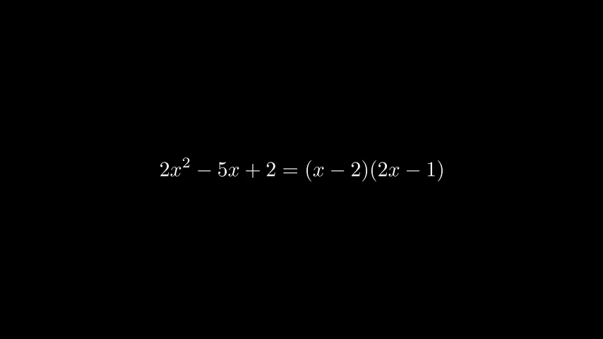
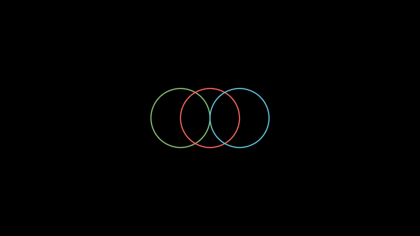

<h2 id="cbcd3fecff4c0ef0c063f8c41726d34a"></h2>


# Manim

There are 2 versions of manim.  One is created by [Grant](https://github.com/3b1b/manim) , and one is forked and maintained by the [Manim Community](https://github.com/ManimCommunity/manim).

Manim Community's version is updated more frequently and better tested than Grant’s version.


<h2 id="05bff63b61f38b96b6f040dfdfc00fa4"></h2>


## Quick Start

create a python file `test_scene.py`

```python
from manim import *

class SquareToCircle(Scene):
    def construct(self):
        circle = Circle()
        square = Square()
        square.flip(RIGHT)
        square.rotate(-3 * TAU / 8)
        circle.set_fill(PINK, opacity=0.5)

        self.play(Create(square))
        self.play(Transform(square, circle))
        self.play(FadeOut(square))
```

run manim ( docker ), render video in low quality.

```bash
$ docker run --rm -it  --user="$(id -u):$(id -g)" -v "$(pwd)":/manim manimcommunity/manim:stable manim test_scene.py SquareToCircle -ql
```

Pretty long command ...

To save life, on linux or OSX, you can create a bash function in your bash profile file to later use

```bash
function manim() {
    docker run --rm -it  --user="$(id -u):$(id -g)" -v "$(pwd)":/manim manimcommunity/manim:stable manim $@
}
```

Life becomes easy ...

```bash
$ manim test_scene.py SquareToCircle -ql
...
    File ready at /manim/media/videos/test_scene/480p15/SquareToCircle.mp4   
```

But can use `-p` parameter to play video right after things done when we use docker manin.

Solution on OSX:

Create a python3 script mplay.py

```python
#!python3
import sys
import re

RE_DST_FILE = re.compile( r'File ready at [\'"]?/manim\/(.+?\.(?:mp4|gif))' )
RE_COLOR_TAG = re.compile( r'·\[\d+(;\d+)?m' )

if __name__=="__main__":
    output=""
    for line in sys.stdin:
        # output stderr, so wont pass to next pipe
        print(line, end="", file=sys.stderr )
        output += line.strip()

    # \x1b, i.e. \e, is not supported in re
    output = output.replace( "\x1b" , "·" )

    output = RE_COLOR_TAG.sub("",output)

    all_mp4 = RE_DST_FILE.findall( output )
    # output 1st video
    if len(all_mp4) > 0 :
        print( all_mp4[0])

```

```bash
$ chmod +x mplay.py
$ cp mplay.py /usr/local/bin/
$ manim test_scene.py SquareToCircle -ql | mplay.py | xargs open 
```

## Get Start

Most content comes from this tutorial [How to Create Mathematical Animations like 3Blue1Brown Using Python](https://towardsdatascience.com/how-to-create-mathematical-animations-like-3blue1brown-using-python-f571fb9da3d1)

### Create a Blue Square that Grows from the Center


```python
# start.py
from manim import *

class PointMovingOnShapes(Scene):
    def construct(self):
        square = Square(color=BLUE) # Create a square
        square.flip(RIGHT) # Flip the square to the right
        square.rotate(-3 * TAU / 8) # Rotate the square -3/8 * 2*PI

         # Play the animation of a square growing from the center
        self.play(GrowFromCenter(square))
```

- A class that derives from `Scene`
    - `construct` method

```bash
$ manim -ql start.py PointMovingOnShapes | mplay.py | xargs open
```

- `-ql` means quality low

### create a gif

- `-i` to create a Gif instead of video

```bash
$ manim -i -ql start.py PointMovingOnShapes | mplay.py 
media/videos/start/480p15/PointMovingOnShapes_ManimCE_v0.7.0.gif
```

### Turn a Square into a Circle, with rotate and flip


```python
from manim import *

class PointMovingOnShapes(Scene):
    def construct(self):

        # Create a square
        square = Square(color=BLUE)
        square.flip(RIGHT)
        square.rotate(-3 * TAU / 8)

        # Create a circle
        circle = Circle()
        circle.set_fill(PINK, opacity=0.5) # set the color and transparency

        # Create animations
        self.play(GrowFromCenter(square))
        self.play(Transform(square, circle))  # turn the square into a circle

        self.wait() # wait for some seconds
```


### List of Manim Shapes

[list of manim shapes](https://docs.manim.community/en/stable/reference/manim.mobject.geometry.html#module-manim.mobject.geometry)

### Customize Manim

- change backgroud color
    ```python
    from manim import *

    config.background_color = YELLOW
    ```
    - 

### Manim Configurations

- [manim configuration](https://docs.manim.community/en/stable/tutorials/configuration.html)

### Mathematical Equations with a Moving Frame


```python
from manim import *

class MovingFrame(Scene):
     def construct(self):
        # Write equations
        equation = MathTex("2x^2-5x+2", "=", "(x-2)(2x-1)")

        # Create animation
        self.play(Write(equation))

        # Add moving frames
        framebox1 = SurroundingRectangle(equation[0], buff=.1)
        framebox2 = SurroundingRectangle(equation[2], buff=.1)

        # Create animations
        self.play(Create(framebox1))  # creating the frame

        self.wait()
        # replace frame 1 with frame 2
        self.play(ReplacementTransform(framebox1, framebox2))
    
        self.wait()

```

### write steps by steps on how to solve an equation:


```python
from manim import *

class MathEquation(Scene):
    def construct(self):

        # Write equations
        equation1 = MathTex("2x^2-5x+2")
        eq_sign_1 = MathTex("=")
        equation2 = MathTex("2x^2-4x-x+2")
        eq_sign_2 = MathTex("=")
        equation3 = MathTex("(x-2)(2x-1)")

        # Put each equation or sign in the appropriate positions
        equation1.next_to(eq_sign_1, LEFT)
        equation2.next_to(eq_sign_1, RIGHT)

        eq_sign_2.shift(DOWN)
        equation3.shift(DOWN)

        # Align bottom equations with the top equations
        eq_sign_2.align_to(eq_sign_1, LEFT)
        equation3.align_to(equation2, LEFT)

        # Group equations and sign
        eq_group = VGroup(equation1, eq_sign_1, equation2, eq_sign_2, equation3)

        # Create animation
        self.play(Write(eq_group))

        self.wait()
```

### Moving and Zooming Camera

adjust the camera and select which part of the equations to zoom in.



```python
from manim import *

class MovingAndZoomingCamera(MovingCameraScene):
    def construct(self):
        # Write equations
        equation = MathTex("2x^2-5x+2", "=", "(x-2)(2x-1)")

        self.add(equation)
        self.play(self.camera.frame.animate.move_to(equation[0]).set(width=equation[0].width*2))
        self.wait(0.3)
        self.play(self.camera.frame.animate.move_to(equation[2]).set(width=equation[2].width*2))

```


### Graph

create an annotated graph 


```python
from manim import *

class Graph(GraphScene):
    def __init__(self, **kwargs):
        GraphScene.__init__(
            self,
            x_min=-3.5,
            x_max=3.5,
            y_min=-5,
            y_max=5,
            graph_origin=ORIGIN,
            axes_color=BLUE,
            x_labeled_nums=range(-4, 4, 2), # x tickers
            y_labeled_nums=range(-5, 5, 2), # y tickers
            **kwargs
        )

    def construct(self):
        self.setup_axes(animate=False)

        # Draw graphs
        func_graph_cube = self.get_graph(lambda x: x**3, RED)
        func_graph_ncube = self.get_graph(lambda x: -x**3, GREEN)

        # Create labels
        graph_lab = self.get_graph_label(func_graph_cube, label="x^3")
        graph_lab2 = self.get_graph_label(func_graph_ncube, label="-x^3", x_val=-3)

        # Create a vertical line
        vert_line = self.get_vertical_line_to_graph(1.5, func_graph_cube, color=YELLOW)
        label_coord = self.input_to_graph_point(1.5, func_graph_cube)
        text = MathTex(r"x=1.5")
        text.next_to(label_coord)

        self.add(func_graph_cube, func_graph_ncube, graph_lab, graph_lab2, vert_line, text)
        self.wait()
```

If you just want to get the PNG image of last frame of the scene, use `-s` parameter.

You can also animate the process of setting up the axes by settinganimate=True

```python
 def construct(self):
        self.setup_axes(animate=True)
        ################### The below is the same as above ################### 
```


### Move Objects Together

Use `VGroup` to group different Manim’s objects and move them together



```python
from manim import *

class GroupCircles(Scene):
    def construct(self):

        # Create circles
        circle_green = Circle(color=GREEN)
        circle_blue = Circle(color=BLUE)
        circle_red = Circle(color=RED)
        
        # Set initial positions
        circle_green.shift(LEFT)
        circle_blue.shift(RIGHT)
        
        # Create 2 different groups
        gr = VGroup(circle_green, circle_red)
        gr2 = VGroup(circle_blue)
        self.add(gr, gr2) # add two groups to the scene
        self.wait()

        self.play((gr + gr2).animate.shift(DOWN)) # shift 2 groups down
        
        self.play(gr.animate.shift(RIGHT)) # move only 1 group
        self.play(gr.animate.shift(UP))

        self.play((gr + gr2).animate.shift(RIGHT)) # shift 2 groups to the right
        self.play(circle_red.animate.shift(RIGHT))
        self.wait()
```

<h2 id="52ef9633d88a7480b3a938ff9eaa2a25"></h2>


## Others

Tutorial using Grant version manim. Not recommended.

1. [Installation & FAQ](manim_FAQ.md)
2. [Tutorial](manim_1.md)
3. [leTax,Array,CrossText](manim_2.md)
4. [Transformations](manim_4.md)
5. [graph scene,Path,Sound,SVG,Image](manim_6.md)
6. [Animation, Rate Func](manim_8.md)


