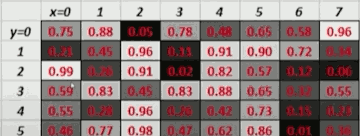

# Math for Game Programmers: Noise-Based RNG


## Limitations of traditional RNG

- Order-dependent
    - generating near-infinite planets ? Mincreaft chunks ? Uh oh...
- Poor random-access
    - Fast-forward 100 numbers in the sequence ?
    - Rewind 3 numbers in the sequence ? 
- Non-trivial instaniation
    - We take LOTS of algorithmic options off the table if we can't make lots of RNGs, fast
- Lack of temporal / spatial coherence
    - have to manually remember previous results in order to interpolate, smooth, etc.


## Noise Functions

### Noise Functions 1

x=0 | 1 | 2 | 3 | 4 | 5 | 6 | 7 | 8 | 9 | 10 | 11 | 12 
--- |  --- |--- |--- |--- |--- |--- |--- |--- |--- |--- |--- |---
0.44 | 0.14 | 0.50 | 0.89 | 0.13 | 0.69 | 0.90 | 0.09 | 0.05 | 0.87 | 0.68 | 0.49 | 0.64


- Put any integer "position" in; get a random float [0,1] ( or uint ) back out
- For any give input value, output is guaranteed to always be the same.
- Feels like a lookup table, but takes no space and is infinitely large


### Noise Function 2 

-  Stateless! Zero bytes ( if you want )!
- No recurrence Relation!
- Thread-safe ( pure function, no external state) !
- Random access ! Order-independence !
- True seeds -- each seed gives a unique (infinite) table, **not** just an offset into a different position in the sequence.

### Noise Function 3

- 
- 

- N-Dimensional
    - 1D position is hash of seed and position (x,y,z...)
- 2D: put in any integer (x,y), get out random value
- For any given input (x,y) , output value is identical
- like an infinite 2D table!


### Noise Function 4

- Okay, but Noise is only good for certain things, right ?
    - Tile variation
        - grass tile #2, grass tile #3
    - Base function for smoothed fractal noise ( e.g. Perlin, simplex )


### Noise Function 5

- Add variance to make things more organic !
- 


### Noise Function 6

- Order-independent RNG !
    - Generate world chunks, planets, villages, NPCs in any order!
    - Consistent results for a seed, regardless of player traversal order !
    - No need to generate everything up front !
        - this is, if want to know where things are going to be, no need to generate everything up front, we can always generate the numbers on demand, and they're always going to be consistent.
        - and because we can generate them in a new order, that means in x order or in y order, that is really a hard problem in RNGs.
    - No need to store/remember massive amounts of RNG data !


### Noise Function 7

Noise Functions are also really useful for 

- Placing scattered placement of objects within an infinite space!
    - this is a very hard problem but its one that you're going to encounter if you do a lot of procedural generation.
    - Use local maxima 
    - Works even better with smoothed fractal noise, e.g. Perlin Noise, Super-easy to adjust object "density" by changing "persistence" !
- Real seeds means infinite infinities of random numbers!
    - Eliminates chance of "sequence syncing"


## RNG vs. Noise

```c++
uint32_t SomeRNG::Rand() {
    m_state = DoSomethingFunkyTo( m_state );
    return m_state;
}

uint32_t SomeNoiseFunction( int position ) {
    return DoSomethingFunkyTo( position ) ;
}
```

## RNG-based Noise ?

```cpp
unit32_t NoiseFunctionMakeFromRNG( int position ) {
    SomeRNG rng( position ) ; // Create a new RNG; use "position" as seed
    return rng.Rand();
}
```

- This totally works, using this generate minecraft worlds.
- But it's not fast. We pay for construction, initialization, seeding, AND rand.

## Noise-based RNG ?

```cpp
Class RngBasedOnNoise {
    RngBasedOnNoise() { m_position = 0;} // constructor
    unit32_t Rand(); // Get the next ranomd number

    int m_positon; // RNG keeps position as only internal state
}

uint32_t RngBasedOnNoise::Rand() {
    return DoSomethingFunkyTo( m_postion++ ) ;
}
```

- No problem.


## Tidbits  and Takeaways


