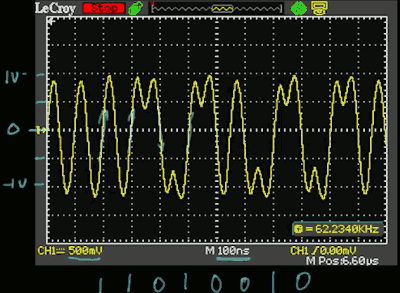

# How do network wire transfer data 

## Sending digital information

1. over a wire
    - ethernet siginal, altering voltage,  say 0v represents 0, 5v represents 1.
2. fiber optics
    - light intensity, say `< 0.2` represents 0, `> 0.8` represents 1
3. radio waves
    - altering voltage to generate sine wave, sending by antenna
    - A.M.
        - amplitude modulation 
    - F.M.
        - frequency modulation 
    - Phase-Shift
        - 

## Clock synchronization and Manchester coding

- we can look at the clock, everywhere it transitions from 0 to 1,  that is a point at which we should read the value of the data.
- Q: what happends if two compute's clock signals aren't running at exactly the same speed ?
    - A: clock slip. you might either miss some bits or get extra bits.
- How to solve it ?
    1. synchronize clocks, maybe through GPS, antenna
    2. send separate clock signal.  so we're sending both the data and the clock across 2 different links.
        - problem:  you tend to not do this on very high speed links over very long distance, or you could get into an issus where the clock gets slightly out of phase with the data
    3. to combine the clock and the data by using different symbols to represents 1s and 0s.
        - Manchester coding: one of the simpler ways of combining clock and data into one signal so that the transmitter and receiver don't need perfectly synchronized clocks.
            - instead of the symbol for a 1 is just a 5v signal, instead the symbol for a 1 is a transition from negative voltage to positive voltage
            - the symbol for a 0 is a transition from  positive voltage to negative voltage
        - 

## The importance of framing

- Q: how do the receiver know what the correct byte boundary is ?   That is, which 8 bits compose one byte ?
    - A: the bytes group is something called frames.
- two different ways to do framing in networks
    1. HDLC: high level data-link control
        - frame delimiter :  flag 01111110
        - but what if our actual data stream has this patter `01111110` ?
        - another rule: whenever there is 5 consective 1s anywhere in data we're sending,  then you should stuff an extra 0 in after those five 1s to prevent this problem.
        - 
            - this technique is called **bit stuffing**
    2. Ethernet is quite different: **inter-frame gap**, followed by a 56 bits **preamble**, alternating 1s and 0s, followd by **frame delimiter** `10101011`, followed by actual data.
        - 
        - frame length
            - A frame can have variable length.  It is a trade-off between the efficiency and quick recover from an error.
            - 64 - 1500 bytes

 

