

- [Procedural level design in Brogue and beyond](#d84c11830b3160235dc21b64911b82e4)
    - [Create a Room](#ac071b8105196d57c677805036bc061c)
    - [Room Accretion](#f7f0bb3e2b800697fadbb756e51decc8)
    - [Machines](#10ac0270a522e137e8810cb6b782fb66)
    - [Machine components](#6de9c2ee939f763e740cd3cc22569929)
    - [Organic pathways between two points](#3a3abd3e9cd69f9e783115c2c2d45d6a)
    - ["Functional" Types of Machines](#6e763c1bb0889f70c737a85b8aeee685)
    - ["Spatial" Types of Machines: Room Machines](#60907e356f65afeb4bfeaac7bd2bc250)
    - ["Spatial" Types of Machines: Vestibule Machines](#35ddfddd6e932febaeb3e2796e1fc240)
    - ["Spatial" Types of Machines: Area Machines](#4e18ef36da6a4896a0bab0016c58af09)

<h2 id="d84c11830b3160235dc21b64911b82e4"></h2>

# Procedural level design in Brogue and beyond

https://www.youtube.com/watch?v=Uo9-IcHhq_w

<h2 id="ac071b8105196d57c677805036bc061c"></h2>

## Create a Room

- A bunch of different ways to create a room
    - Overlapping rectangles
        - you just come up with 2 rectangles, and you place them on top of each other, maybe symmetrically maybe not.
    - Cellular automata blob
        - you take a grid of cells, you fill it randomly, each one maybe 50% chance of being wall or floor, and then any floor that's surrounded by a majority of walls becomes a wall, and vice versa.
        - you can play with the thresholds to get different levels of density and smoothness, but it kind of causes sort of coherent organic shapes to kind of merge from the static that you start with.
    - Big circle
    - Multiple overlaid smaller circles
    - Sometimes with hallway

- 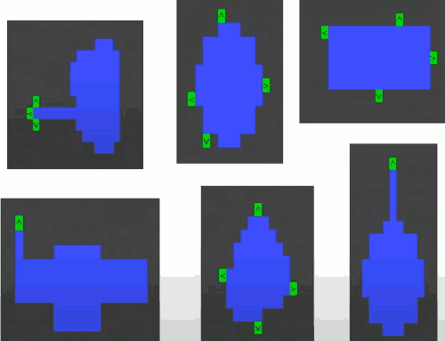
    - these green cells it picks out some door candidates from each direction for each room and that's basically how it comes up with rooms. 

<h2 id="f7f0bb3e2b800697fadbb756e51decc8"></h2>

## Room Accretion

- Start with a room
- Add another room to it
- Repeat until level is full

So it starts by placing one room randomly and then it just starts generating rooms sometimes with hallways, sometimes not,  and it scans through all the locations on the level one at a time in random order until it finds one where the room fits snugly against another room where the door links it up and where it doesn;t overlap any other rooms.

- 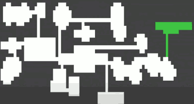
    - add rooms

So that's like the basic practice to come up with the skeleton level design. There is a fatal flaw to it which is that it's like a perfect tree. Each room has exactly one parent (except the first room which has no parents) and any number of children. Which means that if you pick any 2 points on that level, there's exactly one path that doesn't backtrack to get between those 2 points. It looks nice on a screen but it's  not that fun because it's easy to get cornered, it causes a lot of backtracking when you play it.

So the next step is we basically go through again in random order and find wall tiles that have a floor on each of the 2 opposite sides, and if the pathing distance between those 2 floor tiles is large enough then we just turn it into a **door**.  And you just do that until you've found all the candidates.

- 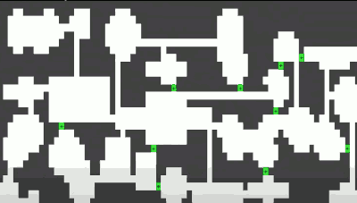
    - add secondary connections

It looks like this when you carve it into the game assets, 

- 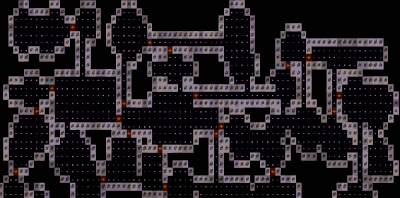

If you play this kind of a level, the rooms are interesting in terms of their shape and connectivity but they're all kind of samey like it's amazing to see passages. I thinks it's cool to give a level kind of a coherent global scale to the features where you can see across the level, you can affect things that aren't just in your local vicinity, things can affect you and when they're not in your local vicinity. And sometimes you can see like secret doors on the other side of the level but not necessarily know how to get to them. So to accomplish that we put in lakes.

- 

And these are again just cellular automata blobs that we create and then again find all the different places on the level where they could be placed, and only place it if it doesn't block the level. And by that I mean "it blocks the level" if you put it somewhere and that makes any pair of walkable tiles inaccessible to one another. So we just scan through kind of brute force see if it blocks, and if not ou just place it. Let them overlap and then kind of assign media type afterward.

- 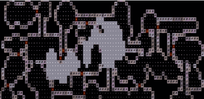

After that you just iterate through place dungeon features, you have trees, you have grass, you have doors... 

The next step is what I call **machines**.

<h2 id="10ac0270a522e137e8810cb6b782fb66"></h2>

## Machines

- 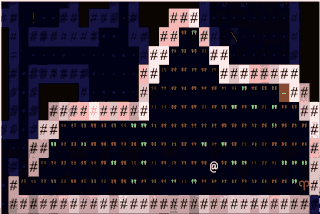

Let's say you come into a room, it's full of dry grass. It's a big open space, and there is an altar with a key at far end of the room. There's a torch on the wall near the door. So the player runs over to the altar and grabs the key and the torch falls off the wall and ignites the grass near the entrance.

- 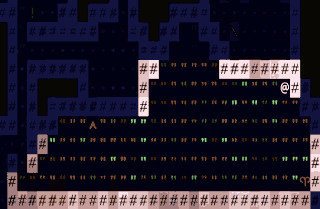

And then the fire gradually spreads toward the player and then the player has to either to use a teleport if he has , or find a spot that's already burned out before the fire reaches you. 

- 

So this is kind of an interesting spatial puzzle it's like a little different every time the stakes are super high although they can be defpending on what other monsters are around what your health level is and so on.

There is another example that the player runs down to the altar grabs the key and somebody's find them on the way out. 

- 

Another example is lava field. The player comes in from the top left.  There's the altar with the key in the top right. There's a door that's completely inaccessible. Somewhere on the level there's probably a potion of fire immunity or potion of levitation or maybe there's a lever hidden in one of the walls and use that to reach the altar and when you reach it then the lava kind of disintegrate or evaporates leaving a pathway to get back out.

- 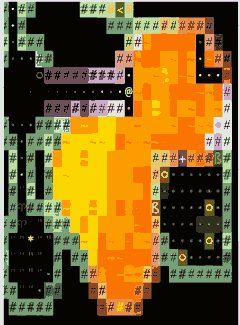

So how do these machines work ?

<h2 id="6de9c2ee939f763e740cd3cc22569929"></h2>

## Machine components

- Machine depends on specific types of terrain and items
- Spatial relationship between these features is **qualitative**.
    - Far / Near / in doorway
    - Within line of sight of door
    - Later features ≥ X spaces away from current feature
    - In the wall
    - Elsewhere on the level
    - How many to generate ? ( Everywhere that qualifies ? )
        - Minimum number required for success ?
- Define with minimal necessary specification (not on a grid)
- Level generator chooses a preexisting area of the level to repurpose.

You just describe it kind of qualitatively in terms of how the things interlock. It's not mapped out on a grid. All that you need is the room to be full of grass, the altar is distant and the torches is near. So come up with a bunch of different relationships that define where these items need to be, where the terrain types need to be, how much space each one needs, whether they need to be in line of signt of the doorway, the minimum number that need to be generated for the room to succeed and actually be built. So the idea is you define it with the minimum amount of specification that you need to make the machine work, and that way the level generator can take this pre-existing level that we saw at the beginning where you just build rooms off of one another can take that kind of skeleton and choose a spot and turn it into one of those machines instead of just placing a machine from a predefined grid and that makes them more interesting.

<h2 id="3a3abd3e9cd69f9e783115c2c2d45d6a"></h2>

## Organic pathways between two points

- Static bridges
- Extending walkways
- Winding tunnels
- Pathway amony traps

How ?

- Build obstructive terrain everywhere in random order
- BUT, don't build in a square if that would block the level
- Repeart until no progress

One kind of sub technique is how you build these sort of meandering pathways between two points. It can be used in bunch of things, bridges, tunnels through granite, pathways between traps.

So how do you do this? 

You just build obstructive terrain everywhere in random order, one cell at a time, and you don't build it if it would block the level. You just keep doing that until all that's left is a single wandering pathways between two points.

  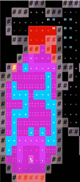    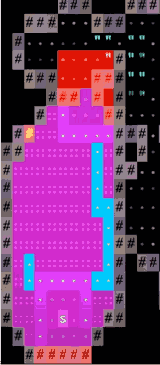  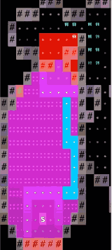

<h2 id="6e763c1bb0889f70c737a85b8aeee685"></h2>

## "Functional" Types of Machines

- Reward Machines
    - Generation is "rubber-banded": the probability goes up every time one is not generated and drops down when one is.
- Key guarding machines
    - something kind of an altar with a key in it
    - Sometimes generate another key item, handed off to another key guarding room, etc.
- Flavor machines
    - interesting terrain, e.g. every room with a decaying sleeping bag and a glyph of warding on the door, and a pile of bones somewhere in the room, maybe an item.

<h2 id="60907e356f65afeb4bfeaac7bd2bc250"></h2>

## "Spatial" Types of Machines: Room Machines

- Interior of an area that has a single chokepoint
    - basically the level generator will look for any point in the level where there's a choke point that dominates a particular number of sort of subordinate cells it doesn't need to be generated as a root at the outsied, just kind of analyzes the level and finds a place where there's a single point that dominates a certain number of other points, and it can turn that into room and sometimes it'll alter the room once it gets there, I'll use cellular automata to widen it out or open it up a bit. 

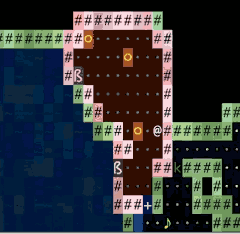  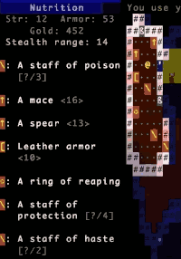 

<h2 id="35ddfddd6e932febaeb3e2796e1fc240"></h2>

## "Spatial" Types of Machines: Vestibule Machines

These are sort of captures the area immediately outside of a room. So find a choke point and then capture the area like a certain number of cells growing outward from the room. So you can have about a bunch of glyphs that will trigger this magic statue outside the door of this room, you have to pick your way carefully to avoid this invulnerable monster attacking you. 

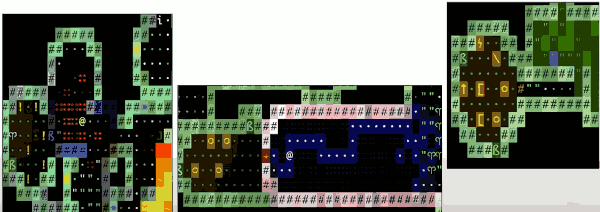

<h2 id="4e18ef36da6a4896a0bab0016c58af09"></h2>

## "Spatial" Types of Machines: Area Machines

Area machine picks a spot on the level that doesn't need to be enclosed by walls necessarily.

So on the left you've got like a switch that you've got to throw an item onto to trigger the switch and access the key.

Or on the right have just have a bunch of golbins standing around a goblin totem which is generated by the machines as well.

---

16:17

