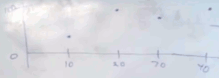
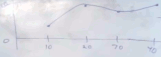
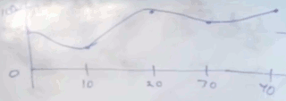
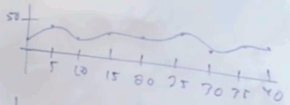
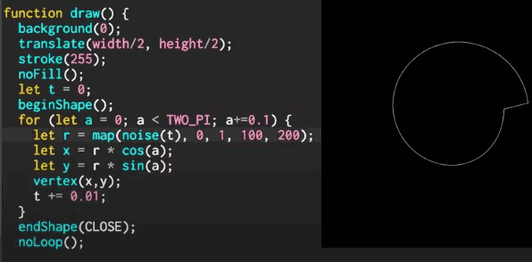
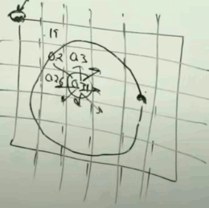
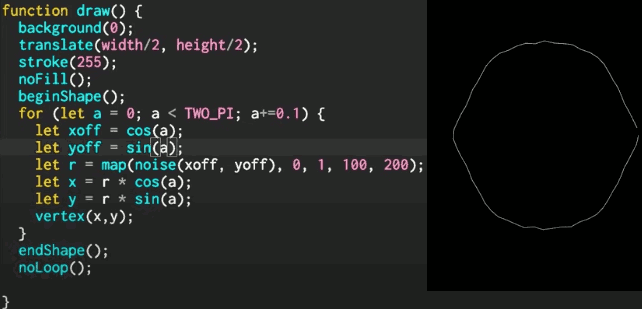
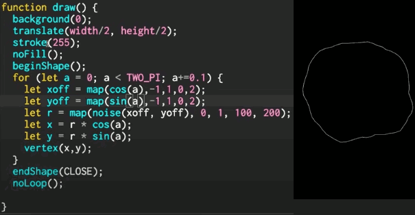

...menustart

- [Perlin Noise](#af3462ddc2e2da770f2e68b7f1c0dc98)
    - [1. Introduction](#71418df45ef46a0f40bd390be0bd5434)
    - [2. noise() vs random()](#66747406635278dfddbc2246d6051ab3)
    - [4. 2D noise](#67885b41eb7504f4224d7a16fd616cee)
    - [6. Coding Challenge #24: Perlin Noise Flow Field](#81ca8128b860dca3c40b5ed6187db988)

...menuend


<h2 id="af3462ddc2e2da770f2e68b7f1c0dc98"></h2>


# Perlin Noise

[src: p5 noise()](https://github.com/processing/p5.js/blob/v1.4.0/src/math/noise.js)

[src: pull p5](https://github.com/processing/p5.js/releases/download/v1.4.0/p5.js)


<h2 id="71418df45ef46a0f40bd390be0bd5434"></h2>


## 1. Introduction

- 1D perlin noise
    - smooth coherent random number
- how to generate ?
    - let's say I'm going to pick random values over time to start with.
        - let's say I'm going to pick them very 10 units of time
        - And I'm to pick those random values with some amplitude, between something like  0~100
        - 
    - Now, the next thing I want to do is to an interpolation function.
        - so here is the start of my Perlin noise function.
        - 
    - Now, the next thing I want to do is to an interpolation function.
    - ANd let's just pretend I also had to pick a value a 0, which let's say I picked this 1
        - 
        - 
    - Now I'm going to do that again. This time, however, I'm going to pick those random values every 5 units of time. 
        - and instead of picking between 0 and 100, I'm just going to pick between 0 and 50. 
        - **double freq, halve amplitude**.
        - 
    - repeat the process,  every 2.5 units of time, and values between 0 and 25
        - 
    - ...
    - Now, what if I were to do this prossibly 8 times, 16 times, 25 times, however many times I want, and each time I'm halving essentially the sampling time interval, and also halving the amplitude ? What then if I take all of these and add them together ?
        - THis is essentially how Perlin noise is calculated. And these, what the above pictures show, by the way, are known as octaves.
    - So Perlin noise is calculated over a number of octaves. And essentially it's a bunch of random waveforms. 
        - **the more ocatves that you have, the more fine detail you're getting.**
        - **the smaller the shrinking factor is (currently 0.5), the smoother the graph has.**.


<h2 id="66747406635278dfddbc2246d6051ab3"></h2>


## 2. noise() vs random()

- perlin noise function needs a parameter: the offset in x-axis, in float.
- calling `noise(100)` always return same value until reinitialize


<h2 id="67885b41eb7504f4224d7a16fd616cee"></h2>


## 4. 2D noise

```javascript
// 2D Noise
// The Coding Train / Daniel Shiffman
// https://thecodingtrain.com/learning/noise/0.5-2d-noise.html
// https://youtu.be/ikwNrFvnL3g
// https://editor.p5js.org/codingtrain/sketches/2_hBcOBrF

// This example has been updated to use es6 syntax. To learn more about es6 visit: https://thecodingtrain.com/Tutorials/16-javascript-es6

let inc = 0.01;

function setup() {
  createCanvas(200, 200);
  pixelDensity(1);
}

function draw() {
  let yoff = 0;
  loadPixels();
  for (let y = 0; y < height; y++) {
    let xoff = 0;
    for (let x = 0; x < width; x++) {
      let index = (x + y * width) * 4;
      // let r = random(255);
      let r = noise(xoff, yoff) * 255;
      pixels[index + 0] = r;
      pixels[index + 1] = r;
      pixels[index + 2] = r;
      pixels[index + 3] = 255;

      xoff += inc;
    }
    yoff += inc;
  }
  updatePixels();
  //noLoop();
}
```


<h2 id="81ca8128b860dca3c40b5ed6187db988"></h2>


## 6. Coding Challenge #24: Perlin Noise Flow Field

- instead of having a grayscale value for each pixel,  what I want to have is a vector, an arrow pointing in some direction according to Perlin noise.
- flow field animation
    ```javascript
    noise( xoff,yoff,zoff )
    ```


- particles
    - for every particles location look up the vector that's nearest to it and then apply that as a force.


## 11. Coding Challenge #136: Polar Perlin Noise Loops

- If you draw a circle with noised vertex , normaly the last vertex won't match the first vertex.
    - 
- To solve this problem, we use 2d perlin noise instead.
    - we pick the noise along the circle in 2D perlin plane
        - 
    - but now it is weirdly symmetrical, why ?
        - 
        - because `cos(a), sin(a)` are [-1,1], but perlin noise space are all positive, it doesn't exists in negative space.
    - let's simply fix it
        - 
        - we can parameterize the maximum noise value 
            ```javascript
            let xoff = map(cos(a),-1,1,0,noiseMax);
            ```
    - 15:51


