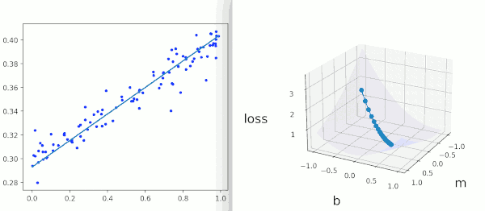

# Introduction to TensorFlow 2.0: Easier for beginners, and more powerful for experts

[youtube](https://www.youtube.com/watch?v=5ECD8J3dvDQ)

[pdf slides](../codes/tf2/tf2_slides.pdf)


<details>
<summary>
Linear Regression Demo:



</summary>

```python
import matplotlib.pyplot as plt
import tensorflow as tf

from tensorflow.keras import Model

# Create a noisy dataset that's roughly linear, according to the equation y = m * x + b + noise.
def make_noisy_data(m=0.1, b=0.3, n=100):
  x = tf.random.uniform(shape=(n,))
  noise = tf.random.normal(shape=(len(x),), stddev=0.01)
  y = m * x + b + noise
  return x, y


x_train, y_train = make_noisy_data()

# plt.plot(x_train, y_train, 'b.')

# Define variables for our model.
# You almost never need to write code this low level.  
#   This is pretending that we don’t have Keras.  We don’t have any 
#   built-in fit methods. We just want to do this from scratch.
m = tf.Variable(0.)
b = tf.Variable(0.)

# Predict y given x.

def predict(x):
  y = m * x + b
  return y

# Our loss will be the squared difference between the predicted values and the true values.
def squared_error(y_pred, y_true):
  return tf.reduce_mean(tf.square(y_pred - y_true)) 

# Calculate loss before training.
loss = squared_error(predict(x_train), y_train)
print("Starting loss", loss.numpy())

# Use gradient descent to gradually improve our guess for m and b. 
#   At each step, we'll nudge them a little bit in the right direction to reduce the loss.
learning_rate = 0.05
steps = 200

for i in range(steps):

  with tf.GradientTape() as tape:
    predictions = predict(x_train)
    loss = squared_error(predictions, y_train)

  gradients = tape.gradient(loss, [m, b])

  m.assign_sub(gradients[0] * learning_rate)
  b.assign_sub(gradients[1] * learning_rate)

  if i % 20 == 0:
    print("Step %d, Loss %f" % (i, loss.numpy()))

# The learned values for m and b.
print ("m: %f, b: %f" % (m.numpy(), b.numpy()))

# Plot the best fit line.
plt.plot(x_train, y_train, 'b.')
plt.plot(x_train, predict(x_train))


# A couple things you can explore:
#   To understand gradient descent, try printing out the gradients calculated below. See how they're used to adjust the variables (m and b).
#   You can use TF 2.0 a lot like NumPy. Try printing out the training data we created (x_train, y_train) and understand the format. 
#   Next, do the same for the variables (m and b). Notice both of these can be converted to NumPy format (with .numpy()).

# Bonus
# Let's visualize the error surface. This section is included purely for fun, you can skip it without missing anything.


# Warning: hacky code ahead

import numpy as np
from mpl_toolkits.mplot3d import Axes3D

# To plot the error surface, we'll need to get the loss
# for a bunch of different values for m and b.

ms = np.linspace(-1, 1)
bs = np.linspace(-1, 1)
m_mesh, b_mesh = np.meshgrid(ms, bs)

def loss_for_values(m, b):
  y = m * x_train + b
  loss = squared_error(y, y_train)
  return loss

zs = np.array([loss_for_values(m, b) for (m,b) in zip(np.ravel(m_mesh), 
                                                      np.ravel(b_mesh))])
z_mesh = zs.reshape(m_mesh.shape)

fig = plt.figure(figsize=(12, 12))
ax = fig.add_subplot(111, projection='3d')
ax.plot_surface(m_mesh, b_mesh, z_mesh, color='b', alpha=0.06)

# At this point we have an error surface. 
# Now we'll need a history of the gradient descent steps.
# So as not to complicate the above code,
# let's retrain the model here, keeping
# track of m, b, and loss at each step.

# Intentionally start with this guess to 
# make the plot nicer
m = tf.Variable(-.5)
b = tf.Variable(-.75)

history = []

for i in range(steps):
  with tf.GradientTape() as tape:
    predictions = predict(x_train)
    loss = squared_error(predictions, y_train)
  gradients = tape.gradient(loss, [m, b])
  history.append((m.numpy(), b.numpy(), loss.numpy()))
  m.assign_sub(gradients[0] * learning_rate)
  b.assign_sub(gradients[1] * learning_rate)

# Plot the trajectory
ax.plot([h[0] for h in history], 
        [h[1] for h in history], 
        [h[2] for h in history],
        marker='o')

ax.set_xlabel('m', fontsize=18, labelpad=20)
ax.set_ylabel('b', fontsize=18, labelpad=20)
ax.set_zlabel('loss', fontsize=18, labelpad=20)

ax.view_init(elev=22, azim=28)

plt.show()
```

</details>
