...menustart

- [Web Development](#e9f65fa4000d038efa0cdff8bb824632)
    - [1 Introduction to HTML5](#be5996bed7586523463bbcd76d0bf636)
        - [1.1 Basic HTML Document Structure](#76b85f6530d019c1c72a47dc5b48bae1)
        - [1.2 HTML Content Models](#04c59e93b33f6071a57b9e6938f738b5)
        - [1.6 Essential HTML5 Tags](#b705e94447e9c6428ee553f502ccc743)
            - [Heading Elements (and some new HTML5 semantic comments)](#260261c999584b61d137523241da00d0)
        - [1.7 Lists](#a7226cd0574e19a2aeafda5137c921c7)
        - [1.8 HTML Character](#e3781d141885ee49010e8cec1a4b8fe7)
        - [1.9 Creating Links](#0a832c76dba506c4db480a4430b81453)
        - [1.10 Displaying Images](#198371eb55bb0b0e5388b4cabe3fce14)
        - [Tag List](#8992b3733c2fabf637100ef09d8a919e)
    - [2 Introduction to CSS3](#9ed1ec1761d9045458cb0194e97ee375)
        - [2.12 Anatomy of a CSS Rule](#3ee16177d865441b806b3b4b549be2cc)
        - [2.13 Element, Class, and ID Selectors](#c451c31d2248f0e6bb75efe3476200bb)
        - [2.14 Combining Selectors](#fd2c9cc9ff66d61b66cfc89a23377201)
        - [2.15 Pseudo-Class Selectors](#ef5ba5d82dce56bbc09fdcc89e36e982)
        - [-- CSS Rules Conflict Resulution and Text Styling --](#e96d5f253dc565df6d115639e013e019)
        - [2.16 Style Placement](#f3479f331d0432d148042fd4ba034751)
        - [2.17 Conflict Resolution](#c1b8822d870403c4cc5ba08ba1b9b546)
        - [2.18 Styling Text](#1417d1be7a57c828a6af9c2753faae90)
        - [-- The Box Model and Layout --](#4bd507279265ea26e3ff1179790a80b7)
        - [2.19 The Box Model](#abd7dc5c80c72e29b2eee3cd3c0c7d78)
        - [2.20 The background Property](#55564951a2060cde6320d03887d7cdea)
        - [2.21 Positioning Elements by Floating](#8530d9fda0ebcc0e0d8e9e153931da3a)
        - [2.22 Relative and Absolute Element Positioning](#ad2a919d3751f45696dda50b54c70ded)
        - [-- Introduction to Responsive Design](#b227c190d97886d7100f1a6412165474)
        - [2.23 Media Queries](#23d37412a01263f81cfb0aa9bed66201)
        - [2.24 Responsive Design](#231c665e5cdd84530dcdcce59571f704)
        - [-- Twitter Bootstrap --](#5d936cee2711b61f0cd5d9e2513e73fa)
        - [2.25 Introduction to Twitter Bootstrap](#91fa20c155a7637398afbe3fa1d70045)
        - [2.26 The Bootstrap Grid System](#da8b77a4befed25e1250a8c43b01654d)

...menuend


<h2 id="e9f65fa4000d038efa0cdff8bb824632"></h2>


# Web Development

- cool sites
    - [codepen](https://codepen.io/)
    - [css tricks](https://css-tricks.com/)
- [course repo](https://github.com/jhu-ep-coursera/fullstack-course4)


<h2 id="be5996bed7586523463bbcd76d0bf636"></h2>


## 1 Introduction to HTML5

- [check wheter a tag can use](https://caniuse.com/)
- [W3C validator for your page](https://validator.w3.org/)

<h2 id="76b85f6530d019c1c72a47dc5b48bae1"></h2>


### 1.1 Basic HTML Document Structure

- self-closing tag: `<p/>`
    - a tag that happens to not to contain any content
    - for example, a placeholder for some other content that we'll dynamically perhaps insert at some later point.
        - but in practice, it'd better use opening/closing pair to signify the lack of content.

<details>
<summary>
<b>Anatomy of an HTML structure</b>
</summary>

```html
<!DOCTYPE html>
<html lang="en">
<head>
    <meta charset="UTF-8">
    <title></title>
</head>
<body>
</body>
</html>
```
- Attributes
    - `charset` : attribute name
    - `"UTF-8"`: attribute value
- doctype declaration
    - `<!DOCTYPE html>`
    - to distinguish between noncompliant and compliant pages
        - noncompliant pages were rendered in what's called the quirks mode
        - compliant pages were rendered in what's called the standards mode
    - if your pages miss doctype declaration, that will signal to the browser that if should treat your pages as one not following HTML standard. Things would be a bit messed up.
    - So to make a long story short always use the simple HTML5 declaration.
- Head
    - contains items that describe the main content of the page.
    - things like 
        - what character coding should the browser use for the main content.
        - authors description
        - page title
        - whatever other external resources are needed to render the page properly.

</details>


<h2 id="04c59e93b33f6071a57b9e6938f738b5"></h2>


### 1.2 HTML Content Models

- The term *content model* refers to which elements are allowed to be nested inside which other elements
- Prior to html5 specification, HTML elements were either block level or inline elements.
    - By default, a block-level element tries to take up as much horizontal space as its containing element will allow

Block-Level Elements | Inline Elements
--- | ---
Render to begin on a new line (by default) |Render on the same line (by default)
May contain inline or other block-level elements |May only contain other inline elements
Roughly Flow Content (HTML5 category) |Roughly Phrasing Content (HTML5 category)


- HTML5 split these 2 content models into **7 models**.
    - [html5 content model](https://www.w3.org/TR/2011/WD-html5-author-20110809/content-models.html#kinds-of-content)
- However, this triditional distinction remains practical because it aligns well with existing CSS rules.

<details>
<summary>
<b>example with dev and span</b>
</summary>

```html
<!doctype html>
<html>
<head>
  <meta charset="utf-8">
  <title>div and span elements</title>
</head>
<body>
  <div>*** DIV 1: Some content here ***</div>
  <div>*** DIV 2: Following right after div 1 ***</div>
  <span>*** SPAN 1: Following right after div 2 ***</span>
  <div>
    *** DIV 3: Following right after span 1 
    <span>*** SPAN 2: INSIDE div 3 ***</span>
    Continue content of div 3 ***
  </div>
</body>
</html>
```

- even though span1 is an inline element, since div2 requires that it be on its own line, it pushes the next inline element to it's own line as well.
- this is exactly what happens with div3. even though span is an inline element, technically speaking the tags shouldn't go anywhere but right behind span1. But since div3 is a block level element, it requires it's own line so it's get pushed to the next line to be by itself.

</details>


<h2 id="b705e94447e9c6428ee553f502ccc743"></h2>


### 1.6 Essential HTML5 Tags

<h2 id="260261c999584b61d137523241da00d0"></h2>


#### Heading Elements (and some new HTML5 semantic comments)

<details>
<summary>
Heading Elements h1, h2, ...
</summary>

```html
<body>
  <h1>This is the Main Heading</h1>
  <h2>Subheading 2</h2>
  <h3>Subheading 3</h3>
  <h4>Subheading 4</h4>
  <h5>Subheading 5</h5>
  <h6>Subheading 6</h6>
</body>
```

- Couple of important points to understand about these elements
    - first, even though their default rendering in the browser appears to give them visual distinction, these should not be used for styling.
        - these elements are only meant to convey structure of your HTML page, nothing more.
        - With CSS,  any regular development can be styled to look like any one of these heading tags.  So, why not just use a `div` ?  Because if we did, we would lose the meaning of what a heading is.
    - second, something that's marked `h1` is obviously the most important and generalized description of the content of this page.

</details>


<details>
<summary>
Some new HTML5 semantic
</summary>

```html
<!doctype html>
<html>
<head>
  <meta charset="utf-8">
  <title>Heading Elements</title>
</head>
<body>
  <header>
    header element - Some header information goes here. Usually consists of company logo, some tag line, etc. Sometimes, navigation is contained in the header as well.
    <nav>nav (short for navigation) element - Usually contains links to different parts of the web site.</nav>
  </header>
  <h1>Main Heading of the Page (hard not to have it)</h1>
  <section>
    Section 1
    <article>Article 1</article>
    <article>Article 2</article>
    <article>Article 3</article>
  </section>
  <section>
    Section 2
    <article>Article 4</article>
    <article>Article 5</article>
    <article>Article 6</article>
    <div>Regular DIV element</div>
  </section>
  <aside>
    ASIDE - Some information that relates to the main topic, i.e., related posts.
  </aside>

  <footer>
    JHU Copyright 2015
  </footer>
</body>
</html>
```

- header tag
    - header information about the page
    - usually consists of company logo, some tagline, navigation.
- nav tag
    - navigation
- section / article
    - no hard rule about them
- aside tag
    - something related to the main content of the page.
- footer tag

</details>

<h2 id="a7226cd0574e19a2aeafda5137c921c7"></h2>


### 1.7 Lists

<details>
<summary>
Unordered List
</summary>

```html
<!DOCTYPE html>
<html>
<head>
  <meta charset="utf-8">
  <title>Unordered Lists</title>
</head>
<body>
  <h1>Unordered list</h1>
  <div>
    
    My typical dinner shopping list:
    <ul>
      <li>Milk</li>
      <li>Donuts</li>
      <li>Cookies
        <ul>
          <li>Chocolate</li>
          <li>Sugar</li>
          <li>Peanut Butter</li>
        </ul>
      </li>
      <li>Pepto Bismol</li>
    </ul>
  </div>
</body>
</html>
```

</details>


<details>
<summary>
Ordered List
</summary>

```html
<!DOCTYPE html>
<html>
<head>
  <meta charset="utf-8">
  <title>Ordered Lists</title>
</head>
<body>
  <h1>Ordered list</h1>
  <div>
    Oreo cookie eating procedure:
    <ol>
      <li>Open box</li>
      <li>Take out cookie</li>
      <li>Make a Double Oreo
        <ol>
          <li>Peel off the top part</li>
          <li>Place another cookie in the middle</li>
          <li>Put back the top part</li>
        </ol>
      </li>
      <li>Enjoy!</li>
    </ol>
  </div>
</body>
</html>
```

</details>


<h2 id="e3781d141885ee49010e8cec1a4b8fe7"></h2>


### 1.8 HTML Character

- 3 Characters You Should Always Escape: 
    - `<, >, &`
    - use: `&lt; &gt; &amp;`
- non-breaking space: `&nbsp;`
    - very commonly used
    - used to make serveral words never to wrap ( always keep in same line )
    - someone use `&nbsp;` to make more extra spaces. That's a total misuse.
        - If you ever wanted to have spaces, or extra spaces, between some words, what you would do is warpping around those text in a *span* tag, and then apply some left margin.
- `"` may be rendered incorrectly when viewing under some limited encoding.
    - can use `&quot;` instead.


<h2 id="0a832c76dba506c4db480a4430b81453"></h2>


### 1.9 Creating Links

<details>
<summary>
Internal Links

> link to a file in the same directory as this HTML file

</summary>

```html
<body>
  <h1>Internal Links</h1>
  <section>
    We can link to a file in the same directory as this HTML file like this:
    <a href="same-directory.html" title="same dir link">Linking to a file in the same directory</a>

    <a href="same-directory.html" title="same dir link">
      <div> DIV Linking to a file in the same directory</div>
    </a>
  </section>
</body>
```

- Notice: the *a* tag is both a Flow content and a Phrasing content.
    - Allow us to take the *a* tag and surround a *div* tag inside it. 
    - The authors of the HTML5 specificatior realized that there are a lot of times where you would like to be able to click on a whole region, e.g. a logo or some sort of a company name in the top left corner for example.
        - Prior to HTML5, people had to use all kinds of tricks in order to achieve that effect because *a* tag was only an inline tag.

</details>


<details>
<summary>
External Links

> can use `target="_blank"` to force open it in a new tab
</summary>

```html
<body>
  <h1 id="top">External Links</h1>
  <section>
    <p>
      Let's link to a Facebook Fan page I created for this course!
      <!-- link to Facebook page WITH TARGET-->
      <a href="http://www.facebook.com/CourseraWebDev" 
      target="_blank" title="Like Our Page!">Course Facebook Page</a>
    </p>
  </section>
</body>
```

</details>


<details>
<summary>
Same Page Links

> href="#id-name"
</summary>

```html
<body>
  <h1 id="top">Links to Sections of The Same Page</h1>
  <section>
    <ul>
      <!-- Link to every section in the page -->
      <li><a href="#section1">#section1</a></li>
      <li><a href="#section2">#section2</a></li>
      <li><a href="#section3">#section3</a></li>
      <li><a href="#section4">#section4</a></li>
      <li><a href="#section5">#section5</a></li>
      <li><a href="#section6">#section6</a></li>
    </ul>

  </section>

  <section id="section1">
    <h3>(#section1) Section 1</h3>
    <p>Section 1 Content</p>
  </section>

  <section id="section2">
    <h3>(#section2) Section 2</h3>
    <p> Section 2 content</p>
  </section>
  <section id="section3">
    <h3>(#section3) Section 3</h3>
    <p>Section 3 content</p>
  </section>
  <section id="section4">
    <h2>(#section4) Section 4</h2>
    <p>Section 4 content</p>
  </section>
  <section id="section5">
    <h2>(#section5) Section 5</h2>
    <p>Section 5 content</p>
  </section>
  <div>
    <h2><a name="section6">(#section6) Section 6</a></h2>
    <p>
      Back to top: <a href="#top">Back to Top</a>
    </p>
  </div>
</body>
```

- You can identify a section a couple of different ways.
    - you can have in any tag that has an *id* with that section name
    - another way is to create a anchor tag with a *name* attribute 
        - similar to *id*

</details>

<h2 id="198371eb55bb0b0e5388b4cabe3fce14"></h2>


### 1.10 Displaying Images

```html
<p>
   
  Some content
</p>
<p>

</p>
```

- alt attribute
    - is used by screen readers that help people with visual impairment.
- it is always a good idea to provide the *width* and *height* attributes.
    - because if the image take time to load, the page might appear jumpy.
    - this is actually the promary reason why you would want to use the width and height of the image. You want to tell the browser to reserver this space.

<h2 id="8992b3733c2fabf637100ef09d8a919e"></h2>


### Tag List

tag | stands for | desc
--- | --- | ---
p | paragraph | 
div | division | most generic block-level element
span | span |  super generic inline element
ul | unordered list | only `li` element is allowed inside it
ol | ordered list 
li | list item


---

<h2 id="9ed1ec1761d9045458cb0194e97ee375"></h2>


## 2 Introduction to CSS3

- CSS: Cascading style sheets

<h2 id="3ee16177d865441b806b3b4b549be2cc"></h2>


### 2.12 Anatomy of a CSS Rule

```css
<style>
p {
    color: blue;
    font-size: 20px;
}

h1 {
    color: green;
    width: 200px;
    text-align: center;
}
</style>
```

- *p* is a **Selector**
    - which is basically saying that whatever rules I'm about to give should apply to the content of **every single** paragraph tag in the entire HTML page.
- Inside the braces, we have CSS declaration.
    - it consists of 2 parts: property and value.
    - **Property** name is something predefined by CSS specification.
    - technically speaking, a semicolon is not a requirement, but it's a best practice to always use it.
    - 0 or more declarations are allowed.
- style sheet
    - the collection of CSS rules.


<h2 id="c451c31d2248f0e6bb75efe3476200bb"></h2>


### 2.13 Element, Class, and ID Selectors

- Selectors
    - CSS selectors are used to determine which HTML element, or set of elements, to apply the CSS declarations to. 
    - The browser uses its selector API to traverse the DOM or Document Object Model, and pick out the elements matching the selector. 
    - Now crafting a selector is a great skill to have and not only for styling using CSS. That's because a lot of JavaScript libraries out there use the browser selector API to attach behavior and data to HTML elements. Much in the same way that CSS applies style to those elements.
- There are 3 different types of selectors: element, class, and id selector.
    - Element Selector: just you specifying the element name
        ```css
        p {
            color: blue;
        }
        ```
        ```html
        <p> ... </p>
        ```
    - Class Selector: is specifyied with a dot and the name of the class
        ```css
        .blue {
            color: blue;
        }
        ```
        ```html
        <p class="blue"> ... </p>
        <div class="blue"> ... </div>
        ```
    - id Selector: specify the value of an id of an element, preceded by a pound sign
        - **least reusable** one, because one id can only appear once in a document.
        ```css
        #name {
            color: blue;
        }
        ```
        ```html
        <div id="name"> ... </div>
        ```
- Grouping Selectors
    ```css
    div, .blue {
        color: blue;
    }
    ```
    - separate selectors with commas


<h2 id="fd2c9cc9ff66d61b66cfc89a23377201"></h2>


### 2.14 Combining Selectors

- Combining Selectors is a very powerful technique that allows you to more precisely target dumb elements.
- most common ways of combining CSS selectors
    - Element With Class Selector
        ```css
        p.big {
            font-size: 20px; 
        }
        ```
        ```html
        <p class="big"> ... </p>
        ```
    - Child Selector
        - affect on the **direct** child
        ```css
        article > p {
            color: blue;
        }
        ```
        ```html
        <article>
            <p> affected </p>
        </article>
        <article>
            <div> <p> Unaffected </p> </div>
        </article>
        ```
    - Descendant Selector
        - affect on child at any level, even if it's not a direct child
        ```css
        article p {
            color: blue;
        }
        ```
        ```html
        <article>
            <p> affected </p>
        </article>
        <article>
            <div> <p> affected </p> </div>
        </article>
        ```
    - Another 2 Selector (less common)
        - Adjacent sibling selector ( selector + selector )
        - General sibling selector ( selector ~ selector )
- Those combinations are  **Not Limited** To Element Selectors
    ```css
    .colored p {
        color: green;
    }
    article > .colored {
        color: red;
    }
    div.makeMeBlue p {
      color: blue;
    }
    ```
    ```html
    <div>
      <div>
        <div class="makeMeBlue">
          <p> Show in blue</p>
        </div>
      </div>
      <section class="makeMeBlue">
        <p> Unaffect </p>
      </section>
    </div>    
    ```

<h2 id="ef5ba5d82dce56bbc09fdcc89e36e982"></h2>


### 2.15 Pseudo-Class Selectors

- Pseudo-class selectors address targeting only the structures that can be targeted by simple combinations of regular selectors, or targeting the ability to style based on user interaction with the page. 
    - For example, we would want the styling of an element to change if the user hovers or moves their mouse over that element
-  The way you specify pseudo-class selector, is by specifying some selector, with a colon, and a predefined pseudo-class
    ```css
    selector:pseudo-class {
        ...
    }
    ```
- Many pseudo-class selectors exist
    - :link     // unvisited 
    - :visited  // visited 
    - :hover    // mouse curor over it
    - :active   // clicked, but not release yet
    - :nth-child(...)
    - ...

- example: remove the prefix dot from an unorderd list 
    ```css
    li {
        list-style: none;
    }
    ```
- example: links has status, after be clicking, another style will be applied to the visited link
    - to make no difference between those 2 status, and create a menu style
    ```css
    a:link, a:visited {
        text-decoration: none;
        background-color: green;
        border: 1px solid blue;
        display: block ;  /* now the bg will fill whole line */
        width: 200px ; /* fix the menu item width */
        text-align: center;
        margin-bottom: 1px;
    }
    ```
- change line style when mouse cursor is on it ,or click on it but not yet releasing.
    ```css
    a:hover, a:active {
        background-color: red;
        color: purple;
    }
    ```
- In a simple form, the nth child pseudo-selector allows you to target a particular element within a list. 
    - change the font-size of 3rd list item to 24px ( start from 1 )
    ```css
    ul li:nth-child(3) {
        font-size: 24px;
    }
    ```
- The nth child pseudo-selector can do much more.
    - ex: change the bg color of all odd line div element
    ```css
    section div:nth-child(odd) {
        background-color: gray;
    }
    ```
    ```html
    <section>
      <div>DIV 1</div>
      <div>DIV 2</div>
      <div>DIV 3</div>
      ...
    </section>
    ```
    - ex: change bg color of 2nd div element when mouse over it
    ```css
    section div:nth-child(2):hover {
        background-color: green;
    }
    ```
- Pseudo-class selectors are very powerful.
    - **Make sure your select is still readable**.
    - Simple/Readable > Complicated/Tricky.

<h2 id="e96d5f253dc565df6d115639e013e019"></h2>


### -- CSS Rules Conflict Resulution and Text Styling --

<h2 id="f3479f331d0432d148042fd4ba034751"></h2>


### 2.16 Style Placement

- Where to place ?
    1. style tag inside the head tag
        - only works for this page, can not be reused for other pages
    2. specify a CSS style directly on the element by providing the style attribute.
        - `<p style="text-align: center;">I am centered!</p>`
        - The only thing that's missing from these styles is the target, and it's for a good reason, since we're inside the element, so we don't really need a target any more. 
        - least reusable
    3. external style sheets
        ```css
        <link rel="stylesheet" href="style.css">
        ```
        - a tag called *link*, `rel` tells the browser that it's a style sheet
        - and its location using the `href` attribute.


<h2 id="c1b8822d870403c4cc5ba08ba1b9b546"></h2>


### 2.17 Conflict Resolution

- If CSS rules conflict, which one would win ?
- 4 Concepts
    1. Origin (Precedence)
    2. Merge
    3. Inheritance
    4. Specificity
- Origin Precedence (when in conflict)
    - same target and same property
    - Last Declaration Wins
- Merge
    - same target , but different property
    - Declarations Merge 
- Inheritance
    - if you specify some CSS property on some element, all the children and grandchildren and so on of the that element will also inherit that property.
- Specificity
    - **Most Specific Selector Combination Wins**.
    - You can think of specificity of your selectors as keeping a score
        - The selectors with the highest score win. 
        - In other words, the selectors with the higher score would be considered the most specific. 
    - It's easier to calculate the score if you arrange the types of things that affect the score from left to right, with the left being the highest value of specificity.
        - `style="..."` , `ID` , `Class, pseudo-class, attribute` , `# of Elements`
        ```css
        /* 1 ,0, 0, 0 */
        <h2 style="color: green;">
        ```
        ```css
        /* 0, 0, 0, 2   ( 2 element div and p ) */
        div p { color; green;}
        ```
    - example
        ```css
        /* css 1 */
        /* 0, 1, 0, 1 */
        div #myParag {
            color: blue;
        }
        ```
        ```css
        /* css 2 */
        /* 0, 0, 1, 2 */
        div.big p {
            color: green;
        }
        ```
        - css 1 wins!
    - `!important`
        - An !important basically says, it doesn't matter what the specificity is, I want to override everything and make this property the way I'm defining it. 
        ```css
        p {
            color green: !important;
        }
        ```
        - **Avoid using !important unless you absolutely have to!**. It leads to nightmare.


<h2 id="1417d1be7a57c828a6af9c2753faae90"></h2>


### 2.18 Styling Text

- font family
    - [CSS Web Safe Fonts](https://www.w3schools.com/cssref/css_websafe_fonts.asp)
    ```css
    xxx {
        font-family: Arial, Helvetica, sans-serif;
    }
    ```
- styling
    ```css
    xxx {
        color: #0000FF;
        font-style: italic;
        font-weight: bold;   /* normal, bold, or numbers, e.g. 900 */
        font-size: 24px;  /* 16px by default */
        text-transform: capitalize; /* lowercase */
        text-align: right;
    }
    ```
- **Relative** Font Sizing
    1. percent
        ```css
        body {
            font-size: 120%;
        }
        ```
    2. em
        - a unit of measurement that is equivalent to the width of the letter
        - it is a relative size, it is relative to something.
        ```html
        <div style="font-size: 2em;" > ...  </div>
        ```
        - PS. now the font-size in this div, is 240% large.  Why not `2m` override `120%` ? 
            - That is kind of where the game of the relative sizing.  They don't have an overriding effect, they have a **cumulative** effect instead.

<h2 id="4bd507279265ea26e3ff1179790a80b7"></h2>


### -- The Box Model and Layout --

<h2 id="abd7dc5c80c72e29b2eee3cd3c0c7d78"></h2>


### 2.19 The Box Model

- In HTML every element is considered a box. However, there's more to that box than just the content that the element wraps around.
    - 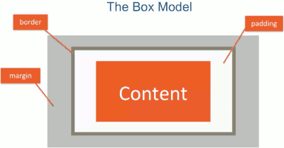
    - margin > border > padding
    - PS. element includes content, padding and border.   Margin is used for layout.
- ex
    ```css
    body {
        margin: 0;
        padding: 0;
    }
    #box {
        margin-bottom: 30px;
        border: 3px solid black;
        width: 300px; /* width of content, not include border,pardding width */
        box-sizing: border-box; /* content + padding + border  */
    }
    ```
- box width / height
    - By default, the box sizing actually set to **content box**, not the entire thing.
    - CSS3 came out with a new value for that propery, called *border-box*.
    - All the mordern frameworks use **border-box** as its sizing model.
        - So, make sure you always stay with a box sizeing of border-box.

- Since you should always try to use border-box. Now, of course, you don't want to specify box-sizing on every element in your entire HTML.
    - So you definitely want to specify it once and then have it be inherited everywhere.  And you try to put it in the `body` style sheet. But it does not work.
    - **box-sizing** is one of those CSS properties that is **not inherited**.
    - The way we get around it is by learning about one more selector, the star select.
- `*` (universal) selector
    ```css
    * {
        box-sizing: border-box;
    }
    ```
    - What star does is going ahead and select every element there is and apply these particular CSS properties to them. 
- Cumulative and Collapsing Margins
    - So if I have a box
        ```css
        #box {
            margin-top: 20px;
            margin-bottom: 30px;
            margin-left: 40px;
            margin-right: 50px;
        }
        ```
    - When 2 boxes is next to each other 
        - The cumulative margin will be 90 pixels. ( [box1]--90-- [box2])
    - But what happens if you have one element on top of the other element ?
        - 50? ❌
        - It is 30. **Margin collapse**. The large margin wins.
            ```
            [box1]
            --30px--
            [box2]
            ```
- Content Overflow
    - if we apply `box-sizing: border-box;`,  and speicfy the `width`, `height` property of box, but the content's actually height is bigger than our `height` value
        - our contents will spill outside of our box
        - 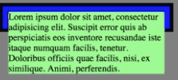
        - How do we deal with this ?
    - *overflow* property
        ```css
        {
            ...
            overflow: auto;  /* visible(defualt), hidden(clip), auto(scrollbar), scroll(2 scrollbars) */
        }
        ```


<h2 id="55564951a2060cde6320d03887d7cdea"></h2>


### 2.20 The background Property

```css
#bg {
    width: 500px;
    height: 500px;
    background-color: blue;
    background-image: url("xxx.png"); /* PS. relative to this CSS file */
    background-repeat: no-repeat ; /* repeat, repeat-x, repeat-y, high priority than bg color */
    background-position: top right ; /* missing axis will set as  center */
    /* background:  url("xxx.png") no-repeat  top right blue; /* put together */
}
```


<h2 id="8530d9fda0ebcc0e0d8e9e153931da3a"></h2>


### 2.21 Positioning Elements by Floating

- knowing how to properly float elements is an essential skill to have, because most of the web UIs today are made by floating the elements. 

<details>
<summary>
Before floating...
</summary>

```css
div {
  background-color: #00FFFF;
}
p {
  width: 50px;
  height: 50px;
  border: 1px solid black;
}

#p1 {
  background-color: #A52A2A;
}
#p2 {
  background-color: #DEB887;
}
#p3 {
  background-color: #5F9EA0;
}
#p4 {
  background-color: #FF7F50;
}
```

```html
<body>
<h1>Floating Elements</h1>

<div>
  <p id="p1"></p>
  <p id="p2"></p>
  <p id="p3"></p>
  <p id="p4"></p>
  <section>This is regular content continuing after the the paragraph boxes.</section>
</div>
</body>
```

</details>

- 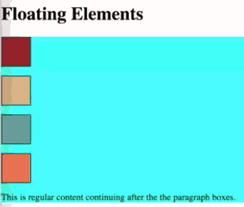

<details>
<summary>
Float p1
</summary>

</details>

```css
#p1 {
  background-color: #A52A2A;
  float: right;
}
```

- 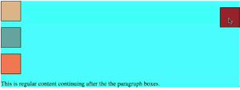
- The box jumped all the way to the right, top edge.
    - The reset boxes moved up as if the maroon box is not there anymore.
        - The reson this is happending is because when you float elements, the browser takes them out of the regular document flow. 
    - Even though each one of these boxes has a margin around them, that margin is collapsed when it is touching the margin of another element. However, when it comes to floated elements, the margins never collapse.


<details>
<summary>
Now make every single box float to the left, and give margin-right 10px
</summary>

```css
p {
  width: 50px;
  height: 50px;
  border: 1px solid black;
  /* new */
  float: left;
  margin-right: 10px;
}

```

</details>

- 
- Our div seemed to have completely collapsed and the only thing that's reallly keeping it open at all is the text in section.
    - This is happening because the same point, floating elements it takes them out of the regular document flow.
    - In order to correct it, we need to tell the browser that when it comes to this section element, the browser should resume the regular document flow. And the way that we do that is by using the *clear* property.
    ```css
    section {
        clear: left;
    }
    ```
    - What this is doing is telling the browser that the section element is announcing that nothing should be allowed to be floating to the left of it.
    - 
    - This is not restricted to the non-floated elements.

- We can ask a floated element to resume its regular document flow, and then float it again.
    - for example, the reason this  cyan box is situated right there because there's something already floated to the left of it. 
    - but if I tells the browser to go ahead and resume the regular document flow on it, it should jump to the next line and then result floating from there on.
    ```css
    #p3 {
      background-color: #5F9EA0;
      clear: left;
    }
    ```
    - 

- *clear* property can have value `both` ( left and right )

<details>
<summary>
Two Column Design
</summary>

```css
<style>
* {
  box-sizing: border-box;
}

p {
  width: 50%;
  /*border: 1px solid black;*/
  float: left;
  padding: 10px;
}

section {
  clear: left;
}

</style>
```

```html
<body>
<h1>Two Column Design</h1>

<div>
  <p id="p1">Lorem ipsum dolor sit amet, consectetur adipisicing elit. Quia distinctio aliquid cupiditate perferendis fuga, sit quasi alias vero sunt non, ratione earum dolores nihil! Consequuntur pariatur totam incidunt soluta expedita.</p>
  <p id="p2">Lorem ipsum dolor sit amet, consectetur adipisicing elit. Dicta beatae voluptatibus veniam placeat iure unde assumenda porro neque voluptate esse sit magnam facilis labore odit, provident a ea! Nulla, minima.Lorem ipsum dolor sit amet, consectetur adipisicing elit. Eius nemo vitae, cupiditate odio magnam reprehenderit esse eum reiciendis repellendus incidunt sequi! Autem, laudantium, accusamus. Doloribus tempora alias minima laborum, provident!</p>
  <section>This is regular content continuing after the the paragraph boxes.</section>
</div>

</body>
```

</details>

- 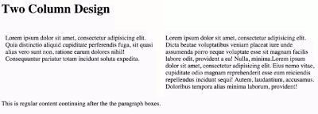

- Summary
    - Floating elements can produce very flexible layouts
    - Floats are taken out of normal document flow
    - Float don't have vertical margin collapse
    - To resume normal document flow, use the **clear** property


<h2 id="ad2a919d3751f45696dda50b54c70ded"></h2>


### 2.22 Relative and Absolute Element Positioning

- Static Positioning (default)
    - Normal document flow. Default for all elements, except html.
    - Positioning offsets are ignored
        - If you try to apply positioning offsets on elements who's position property is set to static, the offsets are just ignored.
- Relative Positioning
    - Element is positioned relative to its position in normal document flow.
        - In other words, if you were to apply offsets on that element, there will be offset from the original normal document flow position of that element.
    - Positioning CSS (offset) properties are:
        - top, bottom, left, right
    - Element is NOT taken out of normal document flow.
        - Even if moved, its original spot is preserved.
            - so as far as the reset of the HTML elements and the reset of the HTML page is concerned, that element is still sitting in its original spot even though visually its off somewhere else.
        - 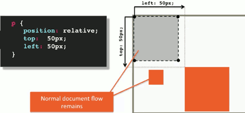
- Absolute Positioning
    - All offset( top, bottom, left, right ) are relative to the position of the nearest ancestor which has positioning set on it, other that static.
    - By default, *html* is the only element that has non-static positioning set on it ( it sets to relative).
    ```css
    p {
        position: absolute;
    }
    ```

<details>
<summary>
Absolute Positioning Element is taken out of normal document flow.
</summary>

- 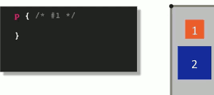
- 
- 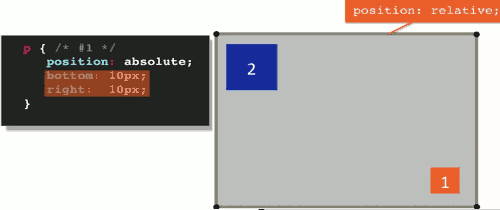
- 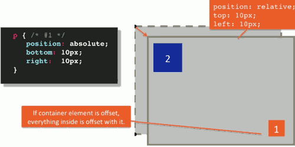

</details>


<h2 id="b227c190d97886d7100f1a6412165474"></h2>


### -- Introduction to Responsive Design

<h2 id="23d37412a01263f81cfb0aa9bed66201"></h2>


### 2.23 Media Queries

- Media queries allow you to group styles together and target them to devices based on some criteria
    - For example, you can target a device by its width, its height, or orientation like landscape or portrait. 
    - One of the most obvious differences between viewing a website on a desktop browser and your cell phone is the screen size. 
    - Remember that using CSS you have the power to produce very different web page layouts from the same HTML.
- Media Query Syntax
    ```css
    @media (max-width: 767px) {
        p {
            color: blue;
        }
    }
    ```
    - Start with `@media` , followed by a media feature, followed by curly brace.
    - Within those curly braces you have your styles, it's basically like a style sheet within a style sheet.
    - Each media feature, e.g. `(max-width: 767px)`,  resolves to either true or false. 
        - You can have more than one media features combine together using logical operators. 
        -  If the media features resolve to true, the style within the curly braces apply.

- Media Query Common Features
    ```css
    @media (max-width: 800px) {}   /* most- */
    @media (min-width: 800px) {}   /* common ones */
    @media (orientation: portrait) {}
    @media screen {}
    @media print {}
    ```
- Media Query Common Logical Operators
    ```css
    /* Devices with width within a range */
    @media (min-width: 768px) and (max-width: 991px) {} 
    /* Comma is equivalent to OR */
    @media (max-width: 767px) , (min-width: 992px) {} 
    ```
- Media Query Common Approach
    ```css
    p { color: blue; } /*base styles*/
    ...
    @media (min-width: 1200px) {...}
    @media (min-width:992px) and (max-width: 1199px) {...}
    ...
    ```
    - You almost always start with some base styles. 
        - Base styles will apply across the board no matter what screen size you actually are viewing the website on. 
    - Then you go ahead and start targeting a particular screen size by either changing some of the properties of the base styles or adding something else to them or maybe taking something away. 
    - Now an important point to point out, and especially when you're using widths of screen sizes of the devices is that you have to be very careful not to overlap range boundaries. ( `>=1200px`, `<1199px`, NOT overlap them )


<details>
<summary>
Media Query Example
</summary>

```html
<!DOCTYPE html>
<html>
<head>
<meta charset="utf-8">
<title>Media Queries</title>
<style>

/********** Base styles **********/
h1 {
  margin-bottom: 15px;
}

p {
  border: 1px solid black;
  margin-bottom: 15px;
}
#p1 {
  background-color: #A52A2A;
  width: 300px;
  height: 300px;
}
#p2 {
  background-color: #DEB887;
  width: 50px;
  height: 50px;
}

/********** Large devices only **********/
@media (min-width: 1200px) {
  #p1 {
    width: 80%;
  }
  #p2 {
    width: 150px;
    height: 150px;
  }
}


/********** Medium devices only **********/
@media (min-width: 992px) and (max-width: 1199px) {
  #p1 {
    width: 50%;
  }
  #p2 {
    width: 100px;
    height: 100px;
  }
  body {
    background-color: blue;
  }
}

</style>
</head>
<body>
<h1>Media Queries</h1>

<p id="p1"></p>
<p id="p2"></p>

</body>
</html>
```

</details>


<h2 id="231c665e5cdd84530dcdcce59571f704"></h2>


### 2.24 Responsive Design

- What is Responsive Web Site ?
    - Site designed to adapt its layout to the viewing environment by using fluid, proportion-based grids, flexible images, and CSS3 media queries.
    - Site's layout adapts to the size of the device
    - Content verbosity or its visual delivery may change 
- The largest part of responsive design is, obviously, the layout. 
    - And the most common layout out there or responsive layout, is a **12-column grid responsive layout** and this is what Twitter bootstrap uses and just about almost really every responsive framework out there uses nowadays. 
    - 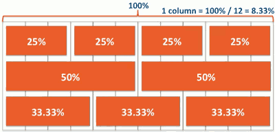
    - 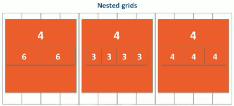


<details>
<summary>
12-Column grid Example
</summary>

[source code](https://raw.githubusercontent.com/jhu-ep-coursera/fullstack-course4/master/examples/Lecture24/responsive-after.html)

- base style
    ```css
    /********** Base styles **********/
    * {
      box-sizing: border-box;
    }
    h1 {
      margin-bottom: 15px;
    }

    p {
      border: 1px solid black;
      background-color: #A52A2A;
      width: 90%;
      height: 150px;
      margin-right: auto; /* scrollbar */
      margin-left: auto;
      font-family: Helvetica;
      color: white;
    }

    /* Simple Responsive Framework. */
    .row {
      width: 100%;
    }
    ```

- large device style
    ```css
    /********** Large devices only **********/
    @media (min-width: 1200px) {
      .col-lg-1, .col-lg-2, .col-lg-3, .col-lg-4, .col-lg-5, .col-lg-6, .col-lg-7, .col-lg-8, .col-lg-9, .col-lg-10, .col-lg-11, .col-lg-12 {
        float: left;
        border: 1px solid green;
      }
      .col-lg-1 {
        width: 8.33%;
      }
      .col-lg-2 {
        width: 16.66%;
      }
      .col-lg-3 {
        width: 25%;
      }
      ...
      .col-lg-12 {
        width: 100%;
      }
    }
    ```
- Medium devices style
    ```css
    /********** Medium devices only **********/
    @media (min-width: 950px) and (max-width: 1199px) {
      .col-md-1, .col-md-2, .col-md-3, .col-md-4, .col-md-5, .col-md-6, .col-md-7, .col-md-8, .col-md-9, .col-md-10, .col-md-11, .col-md-12 {
        float: left;
        border: 1px solid green;
      }
      .col-md-1 {
        width: 8.33%;
      }
      .col-md-2 {
        width: 16.66%;
      }
      ...
      .col-md-6 {
        width: 50%;
      }
      ...
      .col-md-12 {
        width: 100%;
      }
    }
    ```
- page layout
    ```html
    <body>
    <h1>Responsive Layout</h1>

    <div class="row">
      <div class="col-lg-3 col-md-6"><p>Item 1</p></div>
      <div class="col-lg-3 col-md-6"><p>Item 2 Wow this is cool</p></div>
      <div class="col-lg-3 col-md-6"><p>Item 3</p></div>
      <div class="col-lg-3 col-md-6"><p>Item 4</p></div>
      <div class="col-lg-3 col-md-6"><p>Item 5 This is cool</p></div>
      <div class="col-lg-3 col-md-6"><p>Item 6</p></div>
      <div class="col-lg-3 col-md-6"><p>Item 7</p></div>
      <div class="col-lg-3 col-md-6"><p>Item 8</p></div>
    </div>
    </body>
    ```
    - so on large devices `col-lg-3` will be applied, each item takes 25% width
        - 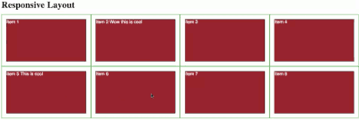
    - on medium devices `col-md-6` will be applied, each item takes 50% width
        - 
    - on other smaller devices
        - 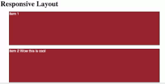
- When we visit this web site on iphone6, we expects it should show each item per row, but it does't. It shows 2 times per row.
    - 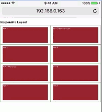
    - How do that happen ?
        - It's a default feature on all the phones.  It just zooms out the font-size. So, they could try to fit the entire content into the viewport of the phone. 
        - How do we tell the phone's browser that, no, this is actually a responsive website and you don't need to try to zoom out, just stay at the regular zoom level ?
            - by applying a special meta tag.
            ```css
            <meta name="viewport" content="width=device-width, initial-scale=1">
            ```
        - It tells the browser to consider its width to be device width, don't try to zoom out and also, its initial scale to be one.
        - 

</details>


<h2 id="5d936cee2711b61f0cd5d9e2513e73fa"></h2>


### -- Twitter Bootstrap --

<h2 id="91fa20c155a7637398afbe3fa1d70045"></h2>


### 2.25 Introduction to Twitter Bootstrap

> "Bootstrap is the most popular HTML, CSS, and JavaScript framework for developing responsive, mobile first projects on the web."

- Mobile First = PLAN mobile from the start
- CSS Framework is mobile ready

- download [bootstrap](https://getbootstrap.com/)
    - you also need download [jQuery](https://jquery.com/) because bootstrap.js depends on jQuery.

- Barebone bootstrap page
    ```html
    <!doctype html>
    <html lang="en">
      <head>
        <meta charset="utf-8">
        <meta http-equiv="X-UA-Compatible" content="IE=edge">
        <meta name="viewport" content="width=device-width, initial-scale=1">
        <title>Bootstrap Starter Page</title>
        <link rel="stylesheet" href="css/bootstrap.min.css">
        <link rel="stylesheet" href="css/styles.css">
      </head>
    <body>

      <h1>Hello Coursera!</h1>

      <!-- jQuery (Bootstrap JS plugins depend on it) -->
      <script src="js/jquery-1.11.3.min.js"></script>
      <script src="js/bootstrap.min.js"></script>
      <script src="js/script.js"></script>
    </body>
    </html>
    ```

<h2 id="da8b77a4befed25e1250a8c43b01654d"></h2>


### 2.26 The Bootstrap Grid System

- Bootstrap Grid System Basic
    ```html
    <div class="container">
        <div class="row">
            <div class="col-md-4">Col 1</div>
        </div>
    </div>
    ```
    - Any Bootstrap grid layout is going to have these components as part of it.
    - First of all, your Bootstrap grid always has to be inside of a **container** wrapper
        - or **container-fluid**, 
        - container-fluid class stretches your layout the full width of the browser and provides consistent padding around your grid and other content.
        - regular container has predetermined fixed width that is still responsive based on the width of browser. In other words, different width at different break point. (break point: media query boundary )
        -  
    - The next component of the grid is the **row**.
        - row class creates horizontal groups of columns, which means that the columns collapsed and interact with each other as a group, but independently from columns in another row.
        - the row class also creates a negative margin, to counteract the padding that the container class sets up. Why is that done? 
            - Well, each column already has its own padding because we want to visually separate columns from each other. If negative margin wasn't applied to the row, the padding of the container would then be in addition to the padding of the edge column. So the content of the column will no longer align nicely with the rest of the content outside of the grid.
            -  , 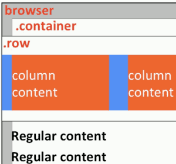
    - Now move to the column. 
        - Every Bootstrap column class is defined using this template.
        - `col-SIZE-SPAN`
            - SIZE: screen width range identifier, columns will collapse(stack) below that *SIZE* unless another rule applies
            - SPAN: how many columns one element shoud span, 1~12
    - Lastly, there's nothing magical about using DIVs. You're free to use whatever makes sense to you in your design.
        ```html
        <header class="container">
            <nav class="row">
                <div class="col-md-4">Col 1</div>
            </nav>
        </header>
        ```
- Example
    ```html
      <div class="container-fluid">
        <div class="row">
          <div class="col-md-4 col-sm-6">Col 1</div>
          <div class="col-md-4 col-sm-6">Col 2</div>
          <div class="col-md-4 col-sm-6">Col 3</div>
        </div>

        <div class="row">
          <div class="col-xs-6">Col 1</div>
          <div class="col-xs-6">Col 2</div>
          <div class="col-xs-6">Col 3</div>
        </div>
      </div>``
    ```

### Css Grid

- [css grid ex 1](https://mebusy.github.io/notes/css_grid_example/cssgrid1.html)
- [css grid ex 2](https://mebusy.github.io/notes/css_grid_example/cssgrid2.html)
- [css grid ex 3](https://mebusy.github.io/notes/css_grid_example/cssgrid3.html)


