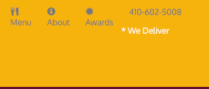

...menustart

- [Web Dev](#e038f9e554416040d7422224d511efc8)
    - [Build A Site](#7c966884500df50e99e58ad85756a2e0)
        - [3.27 Visit with the Client](#25780d343c9a7a3ced213f0ceae7143f)
        - [3.30 Coding Basics of Navbar Header](#b827c8b2fe3c152fc53d255717668023)

...menuend


<h2 id="e038f9e554416040d7422224d511efc8"></h2>


# Web Dev

[bootstrap 3.4 Glyphicons](https://getbootstrap.com/docs/3.4/components/)

<h2 id="7c966884500df50e99e58ad85756a2e0"></h2>


## Build A Site

<h2 id="25780d343c9a7a3ced213f0ceae7143f"></h2>


### 3.27 Visit with the Client

- Most clients have NO IDEA what they want!
    - It's YOUR JOB to ask questions to figure it out
- LESS (information) IS MORE!
    - Encourage your client not to cram information on the site


<h2 id="b827c8b2fe3c152fc53d255717668023"></h2>


### 3.30 Coding Basics of Navbar Header

- [Bootstrap NavBar doc](https://getbootstrap.com/docs/5.0/components/navbar/)
- Yellow navigation area
    - 


```html
  <header>
    <nav id="header-nav" class="navbar navbar-default">
      <div class="container">
      </div>
    </nav>
  </header>
```

- utilize `header` tag
- nav element
    - two classes provide by bootstrap: `navbar navbar-default` , one is the base class, the other is its sub-class.


```css
/** HEADER **/
#header-nav {
  background-color: #f6b319;
  border-radius: 0;
  border: 0;
}
```

---

- Now add some items on nav bar
    ```html
      <div class="container">
        <div class="navbar-header">
          <a href="index.html" class="pull-left visible-md visible-lg ">
            <div id="logo-img"></div>
          </a>
          <div class="navbar-brand">
            <a href="index.html"><h1>David Chu's China Bistro</h1></a>
            <p>
              
              <span>Kosher Certified</span>
            </p>
          </div>
        </div>
    ```
    - navbar-header class
        - a wrapper class that a lot of other classes will depend on being in this position in order to work properly
        - there's some padding that's involved, sometimes it floats and sometimes it will do other things.
        - Brand and toggle get grouped for better mobile display

    - navbar-brand class 
        - already float left
    - "pull-left" is the bootstrap way to float left
    - 
    - We don't want to show logo on small screen devices, use `visible-md visible-lg` to control on which device the logo should display
    - 

---

- add a nav bar menu, and collapse it on small screen size device
    - 
    ```html
      <button type="button" class="navbar-toggle collapsed" data-toggle="collapse" data-target="#collapsable-nav" aria-expanded="false">
        <span class="sr-only">Toggle navigation</span>
        <span class="icon-bar"></span>
        <span class="icon-bar"></span>
        <span class="icon-bar"></span>
      </button>
    ```
    - `navbar-toggle`  class controlling the position and styling of this while button
        - float right
    - `collapsed` class actually does not exist in bootstrap. What it is doing is signifying to a bootstrap plugin, that this button is in a collapsed state. That is, nobody's clicked on it yet. and once somebody clicks on it, this `collapsed` class will go away.
        - all of that is done automatically by the bootstrap collapse plugin.
        - you can find that plugin `collapse.js` in bootstrap.js
    - `data-toggle="collapse"` 
        - `data-*` are html attributes that allow JavaScript plugins or code to get these attributes very, very easily in a standardized way.
    - `data-target="#collapsable-nav"` 
        - very important.  `#collapsable-nav` is going to include all of those navigation menus that will be collapsing.
        - you should create a html element, and set its id as `collapsable-nav`
    - `aria-expanded`  is for screen readers.
        - `<span class="sr-only">Toggle navigation</span>`  will never diaplay because `sr-only`,  screen-reader-only

---

- add menu items outside `navbar-header`
    ```html
        <div id="collapsable-nav" class="collapse navbar-collapse">
           <ul id="nav-list" class="nav navbar-nav navbar-right">
            <li>
              <a href="menu-categories.html">
                <span class="glyphicon glyphicon-cutlery"></span><br class="hidden-xs"> Menu</a>
            </li>
            <li>
              <a href="#">
                <span class="glyphicon glyphicon-info-sign"></span><br class="hidden-xs"> About</a>
            </li>
            <li>
              <a href="#">
                <span class="glyphicon glyphicon-certificate"></span><br class="hidden-xs"> Awards</a>
            </li>
            <li id="phone" class="hidden-xs">
              <a href="tel:410-602-5008">
                <span>410-602-5008</span></a><div>* We Deliver</div>
            </li>
          </ul><!-- #nav-list -->
        </div><!-- .collapse .navbar-collapse -->
    ```
    - this is our `collapsable-nav` element, it need 2 required classes : `collapse` and `navbar-collapse`
    - `nav navbar-nav` is basically saying that I'm going to be a component of our navigation bar , or navigation. These classes basically turn our un-ordered list into this nicely done menu right there in the navigation bar.
    - `navbar-right` is similar to `pull-right`,  to float all the way to the right.
        - 
        - 
    - `glyphicon glyphicon-cutlery`  to bring in what's called icon font. An icon font is basically a vector based image that is able to behave in the same way that the font would behave.
        - e.g. "glyphicon glyphicon-cutlery" will show us a pair of fork and knife.
    - `br class="hidden-xs"`
        - normally, the icon and text break into 2 lines
        - but on small size devices, they are in same line.
    - `<a href="tel:410-602-5008">` will trigger the phone to call.


- new font-size: vw 
    - `font-size: 5vw; /* 1vw = 1% of viewport width */`


